# Screen
1. What is screen?
2. The network
3. Screens already running
4. ssh into machine running screens
5. List screens {screen -list}
6. Reattach screen {screen -r name}
7. Switch between panes {C-a #}
8. Rename pane {C-a A}
9. Switch panes again
10. Leave process running!
11. Detach screen {C-a d}
12.

## 1. What is ‘screen’?
Screen manages multiple sets of terminal windows (panes), allowing you to
switch between them while keeping them all running.
You can also run multiple screen sessions, each with their own set of panes,
and switch between sessions while keeping them all running.
It’s like having multiple desktops, but only for terminal windows.

## 2. The network

## 3. Screens already running
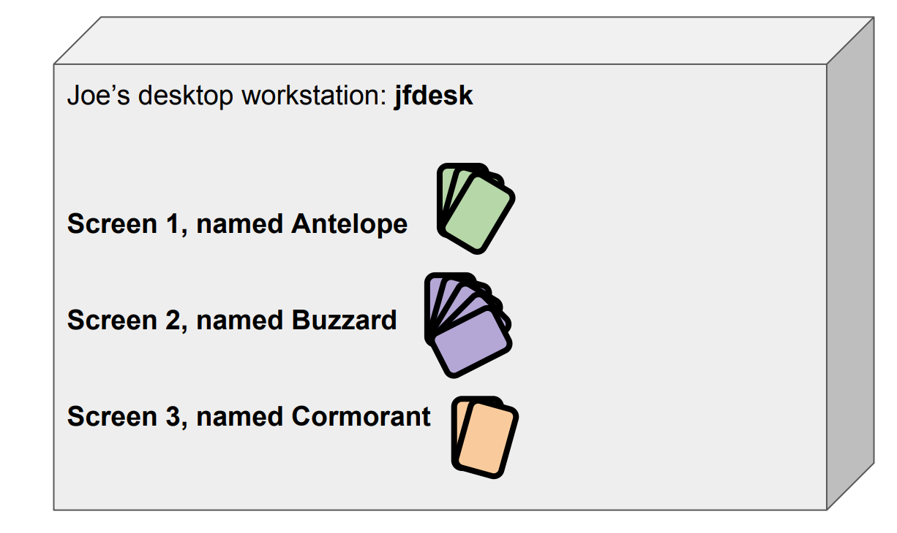

## 4. ssh into machine running screens
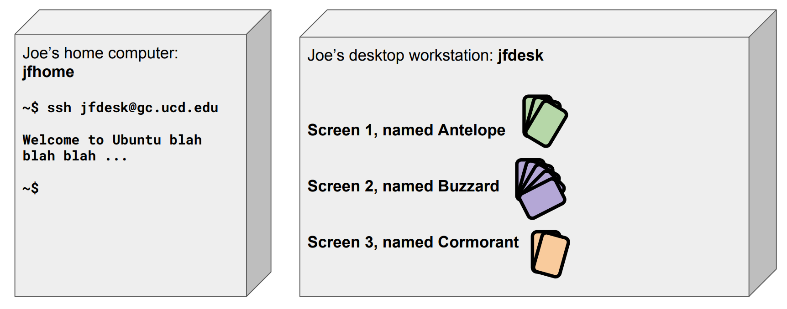

## 5. List screens {screen -list}
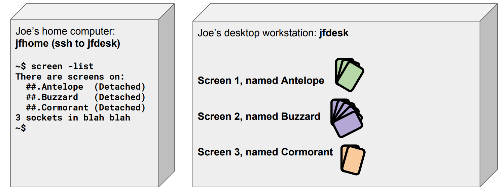

## 6. Reattach screen {screen -r name}
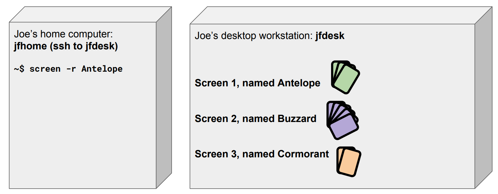

## 7. Switch between panes {C-a #}
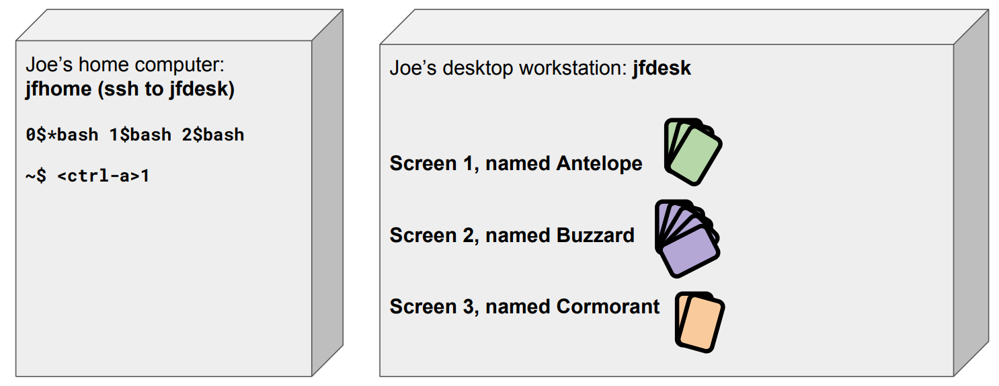

## 8. Rename pane {C-a A}
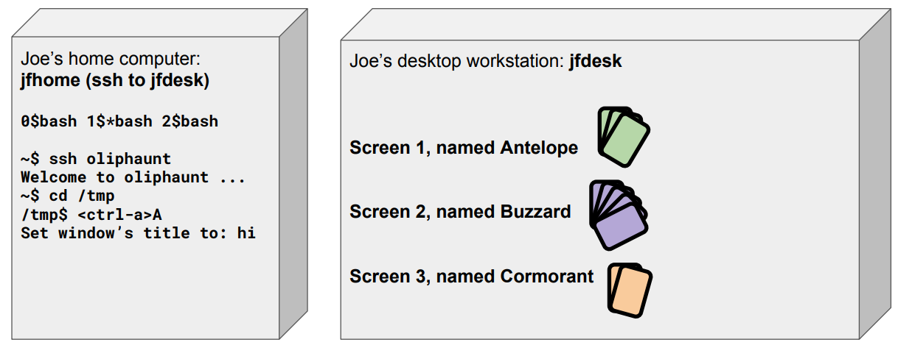

## 9. Switch panes again
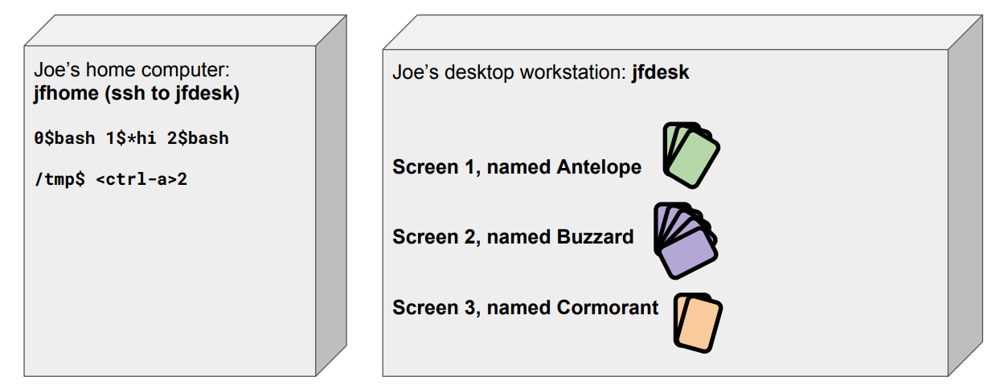

## 10. Leave process running!
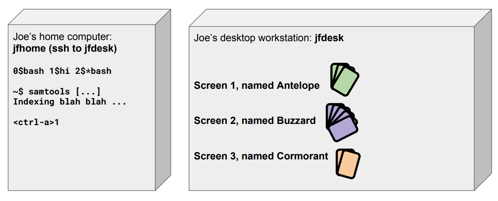

## 11. Detach screen {C-a d}

## 12. Reattach screen {screen -r name}
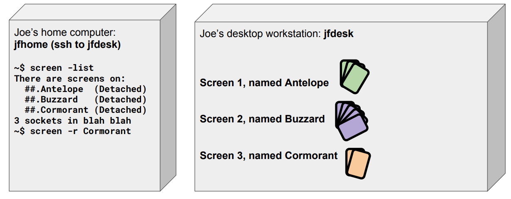

## 13. Create pane {C-a c}
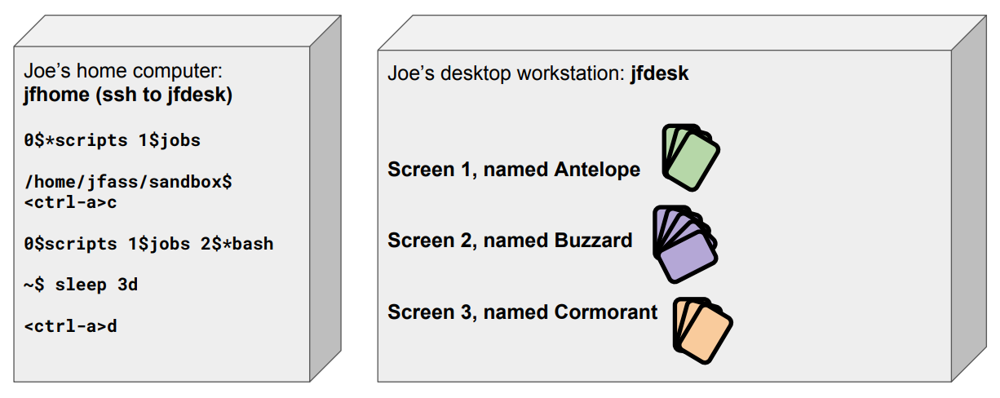

## 14. Reattach, switch panes

## 15. Kill pane {C-a k, then y}
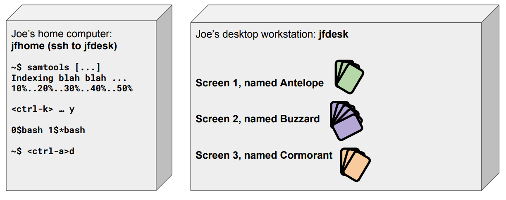

## 16. New screen {screen -S name}
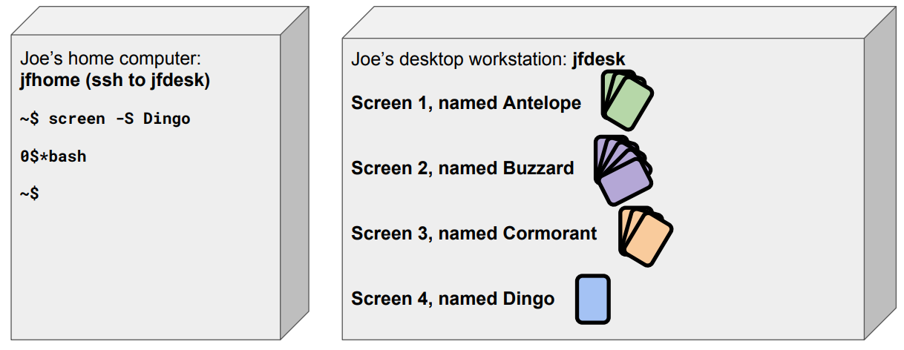

## 17. Exit server, screens still running!
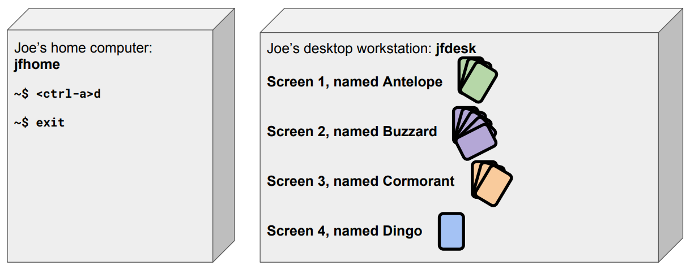