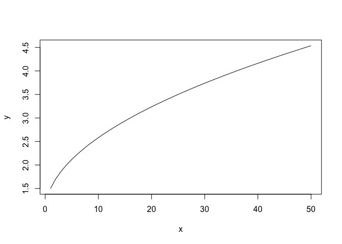
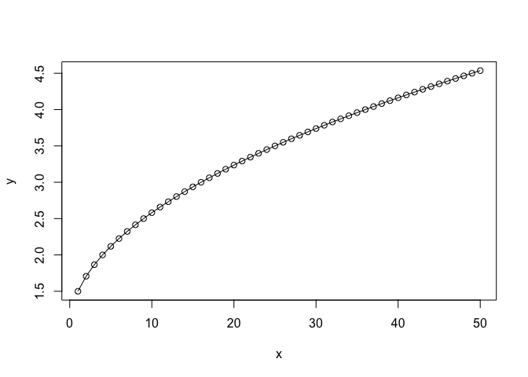
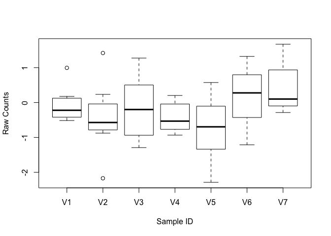
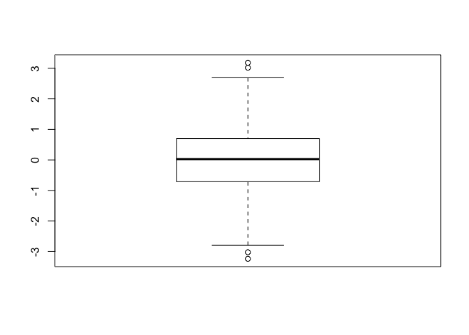
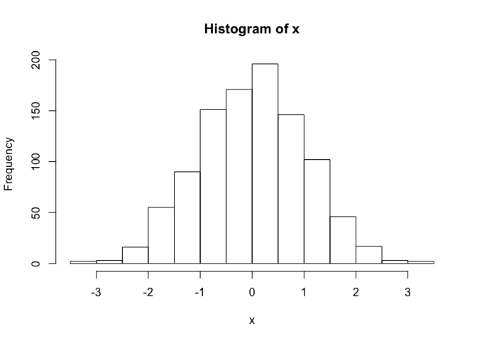
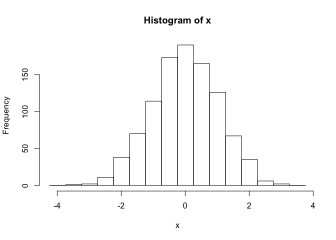
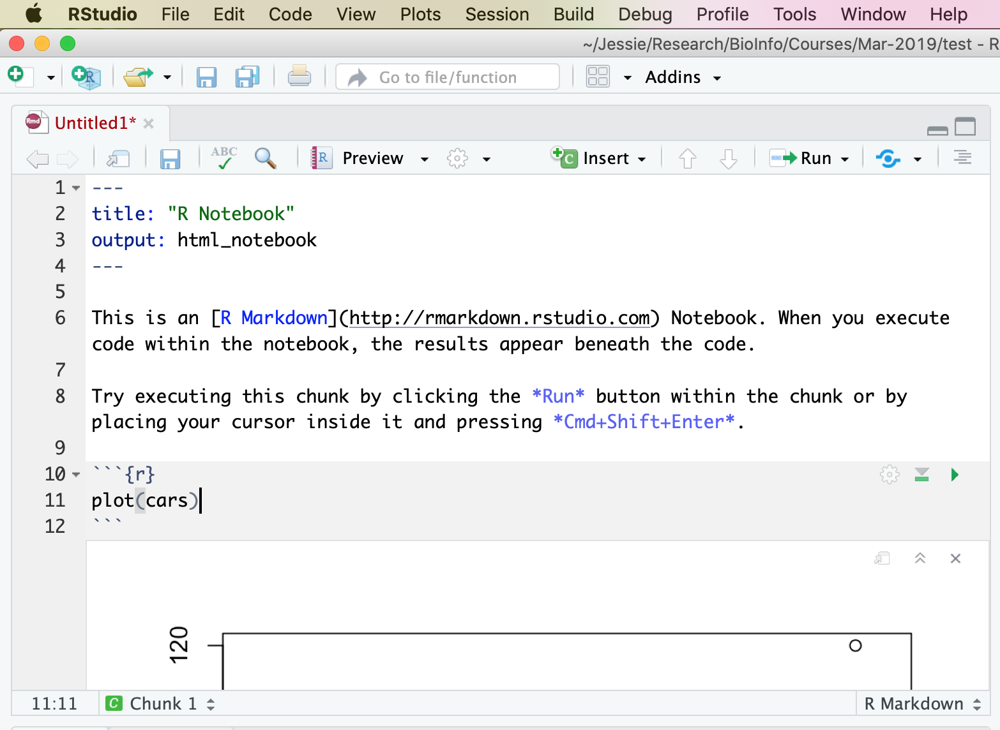
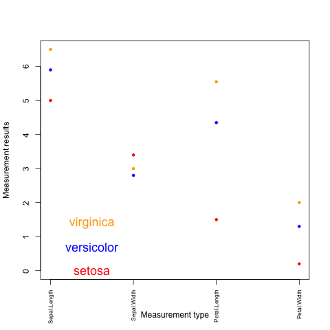

# R and RStudio

## What is R?
[R](http://r-project.org/) is a language and environment for statistical computing and graphics developed in 1993. It provides a wide variety of statistical and graphical techniques (linear and nonlinear modeling, statistical tests, time series analysis, classification, clustering, ...), and is highly extensible, meaning that the user community can write new R tools. It is a GNU project (Free and Open Source).

The R language has its roots in the S language and environment which was developed at Bell Laboratories (formerly AT&T, now Lucent Technologies) by John Chambers and colleagues. R was created by Ross Ihaka and Robert Gentleman at the University of Auckland, New Zealand, and now, R is developed by the R Development Core Team, of which Chambers is a member. R is named partly after the first names of the first two R authors (Robert Gentleman and Ross Ihaka), and partly as a play on the name of S. R can be considered as a different implementation of S. There are some important differences, but much code written for S runs unaltered under R.

Some of R's strengths:

* The ease with which well-designed publication-quality plots can be produced, including mathematical symbols and formulae where needed. Great care has been taken over the defaults for the minor design choices in graphics, but the user retains full control.
* It compiles and runs on a wide variety of UNIX platforms and similar systems (including FreeBSD and Linux), Windows and MacOS.
* R can be extended (easily) via packages.
* R has its own LaTeX-like documentation format, which is used to supply comprehensive documentation, both on-line in a number of formats and in hardcopy.
* It has a vast community both in academia and in business.
* It's FREE!   

## The R environment
R is an integrated suite of software facilities for data manipulation, calculation and graphical display. It includes

* an effective data handling and storage facility,
* a suite of operators for calculations on arrays, in particular matrices,
* a large, coherent, integrated collection of intermediate tools for data analysis,
* graphical facilities for data analysis and display either on-screen or on hardcopy, and
* a well-developed, and effective programming language which includes conditionals, loops, user-defined recursive functions and input and output facilities.

The term "environment" is intended to characterize it as a fully planned and coherent system, rather than an incremental accretion of very specific and inflexible tools, as is frequently the case with other data analysis software.

R, like S, is designed around a true computer language, and it allows users to add additional functionality by defining new functions. Much of the system is itself written in the R dialect of S, which makes it easy for users to follow the algorithmic choices made. For computationally-intensive tasks, C, C++ and Fortran code can be linked and called at run time. Advanced users can write C code to manipulate R objects directly.

Many users think of R as a statistics system. The R group prefers to think of it of an environment within which statistical techniques are implemented.   

## The R Homepage
The R homepage has a wealth of information on it,

[R-project.org](http://r-project.org/)

On the homepage you can:

* Learn more about R
* Download R
* Get Documentation (official and user supplied)
* Get access to CRAN 'Comprehensive R archival network'

## Interface for R

There are many ways one can interface with R language. Here are a few popular ones:

* [RStudio](https://raw.githubusercontent.com/ucdavis-bioinformatics-training/2019-March-Bioinformatics-Prerequisites/master/wednesday/Intro2R/rstudio.png)
* [RGui](https://raw.githubusercontent.com/ucdavis-bioinformatics-training/2019-March-Bioinformatics-Prerequisites/master/wednesday/Intro2R/rgui.png)
* Jupyter and R notebooks
* text editors, such as vi(m), Emacs...


## RStudio

[RStudio](http://rstudio.com/) started in 2010, to offer R a more full featured integrated development environment (IDE) and modeled after matlab's IDE.

RStudio has many features:

* syntax highlighting
* code completion
* smart indentation
* "Projects"
* workspace browser and data viewer
* embedded plots
* Markdown notebooks, Sweave authoring and knitr with one click pdf or html
* runs on all platforms and over the web
* etc. etc. etc.

RStudio and its team have contributed to many R packages.[13] These include:

* Tidyverse – R packages for data science, including ggplot2, dplyr, tidyr, and purrr
* Shiny – An interactive web technology
* RMarkdown – Insert R code into markdown documents
* knitr – Dynamic reports combining R, TeX, Markdown & HTML
* packrat – Package dependency tool
* devtools – Package development tool

RStudio Cheat Sheets: [rstudio-ide.pdf](https://github.com/rstudio/cheatsheets/raw/master/rstudio-ide.pdf)


---
# Programming fundamentals


There are three concepts that are essential in any programming language:

* <font color='purple'>Variables</font>

A variable is a named storage. Creating a variable is to reserve some space in memory. In R, the name of a variable can have letters, numbers, dot and underscore. However, a valid variable name cannot start with a underscore or a number, or start with a dot that is followed by a number.


* <font color='purple'>Operations</font>

<table class="table table-striped" style="width: auto !important; ">
<caption>Assignment Operators in R</caption>
 <thead>
  <tr>
   <th style="text-align:center;"> Operator </th>
   <th style="text-align:center;"> Description </th>
  </tr>
 </thead>
<tbody>
  <tr>
   <td style="text-align:center;"> &lt;-, = </td>
   <td style="text-align:center;"> Assignment </td>
  </tr>
</tbody>
</table>

<table class="table table-striped" style="width: auto !important; ">
<caption>Arithmetic Operators in R</caption>
 <thead>
  <tr>
   <th style="text-align:center;"> Operator </th>
   <th style="text-align:center;"> Description </th>
  </tr>
 </thead>
<tbody>
  <tr>
   <td style="text-align:center;"> \+ </td>
   <td style="text-align:center;"> Addition </td>
  </tr>
  <tr>
   <td style="text-align:center;"> \- </td>
   <td style="text-align:center;"> Subtraction </td>
  </tr>
  <tr>
   <td style="text-align:center;"> \* </td>
   <td style="text-align:center;"> Multiplication </td>
  </tr>
  <tr>
   <td style="text-align:center;"> / </td>
   <td style="text-align:center;"> Division </td>
  </tr>
  <tr>
   <td style="text-align:center;"> ^ </td>
   <td style="text-align:center;"> Exponent </td>
  </tr>
  <tr>
   <td style="text-align:center;"> %% </td>
   <td style="text-align:center;"> Modulus </td>
  </tr>
  <tr>
   <td style="text-align:center;"> %/% </td>
   <td style="text-align:center;"> Integer Division </td>
  </tr>
</tbody>
</table>

<table class="table table-striped" style="width: auto !important; ">
<caption>Relational Operators in R</caption>
 <thead>
  <tr>
   <th style="text-align:center;"> Operator </th>
   <th style="text-align:center;"> Description </th>
  </tr>
 </thead>
<tbody>
  <tr>
   <td style="text-align:center;"> &lt; </td>
   <td style="text-align:center;"> Less than </td>
  </tr>
  <tr>
   <td style="text-align:center;"> &gt; </td>
   <td style="text-align:center;"> Greater than </td>
  </tr>
  <tr>
   <td style="text-align:center;"> &lt;= </td>
   <td style="text-align:center;"> Less than or equal to </td>
  </tr>
  <tr>
   <td style="text-align:center;"> &gt;= </td>
   <td style="text-align:center;"> Greater than or equal to </td>
  </tr>
  <tr>
   <td style="text-align:center;"> == </td>
   <td style="text-align:center;"> Equal to </td>
  </tr>
  <tr>
   <td style="text-align:center;"> != </td>
   <td style="text-align:center;"> Not equal to </td>
  </tr>
</tbody>
</table>

<table class="table table-striped" style="width: auto !important; ">
<caption>Logical Operators in R</caption>
 <thead>
  <tr>
   <th style="text-align:center;"> Operator </th>
   <th style="text-align:center;"> Description </th>
  </tr>
 </thead>
<tbody>
  <tr>
   <td style="text-align:center;"> ! </td>
   <td style="text-align:center;"> Logical NOT </td>
  </tr>
  <tr>
   <td style="text-align:center;"> &amp; </td>
   <td style="text-align:center;"> Element-wise logical AND </td>
  </tr>
  <tr>
   <td style="text-align:center;"> &amp;&amp; </td>
   <td style="text-align:center;"> Logical AND </td>
  </tr>
  <tr>
   <td style="text-align:center;"> | </td>
   <td style="text-align:center;"> Element-wise logical OR </td>
  </tr>
  <tr>
   <td style="text-align:center;"> || </td>
   <td style="text-align:center;"> Logical OR </td>
  </tr>
</tbody>
</table>

* <font color='purple'>Functions</font>

A function is a block of organized, reusable code that is used to perform a set of predefined operations. A function may take zero or more parameters and return a result. The way to use a function in R is:

**function.name(parameter1=value1, ...)**

In R, in order to get help information on a funciton, one may use the command *?function.name*.

---
# Topics covered in this introduction to R

1. Basic data types in R
2. Basic data structures in R
3. Import and export data in R
4. Functions in R
5. Basic statistics in R
6. Simple data visulization in R
7. Install packages in R
8. Save data in R session
9. R notebook

---
#Topic 1. Basic data types in R

## There are 5 basic atomic classes: logical, integer, numeric, complex, and character.

Examples of numeric values.

```r
# assign number 150 to variable a.
a <- 150
a
```

```
## [1] 150
```

```r
# assign a number in scientific format to variable b.
b <- 3e-2
b
```

```
## [1] 0.03
```

Examples of character values.

```r
# assign a string "BRCA1" to variable gene
gene <- "BRCA1"
gene
```

```
## [1] "BRCA1"
```

```r
# assign a string "Hello World" to variable hello
hello <- "Hello World"
hello
```

```
## [1] "Hello World"
```

Examples of logical values.

```r
# assign logical value "TRUE" to variable brca1_expressed
brca1_expressed <- TRUE
brca1_expressed
```

```
## [1] TRUE
```

```r
# assign logical value "FALSE" to variable her2_expressed
her2_expressed <- FALSE
her2_expressed
```

```
## [1] FALSE
```

```r
# assign logical value to a variable by logical operation
her2_expression_level <- 0
her2_expressed <- her2_expression_level > 0
her2_expressed
```

```
## [1] FALSE
```

To find out the type of variable.

```r
class(her2_expressed)
```

```
## [1] "logical"
```

```r
# To check whether the variable is a specific type
is.numeric(gene)
```

```
## [1] FALSE
```

```r
is.numeric(a)
```

```
## [1] TRUE
```

```r
is.character(gene)
```

```
## [1] TRUE
```

In the case that one compares two different classes of data, the coersion rule in R is <font color='red'>logical -> integer -> numeric -> complex -> character</font> . The following is an example of converting a numeric variable to character.


```r
b
```

```
## [1] 0.03
```

```r
as.character(b)
```

```
## [1] "0.03"
```

---
# Topic 2. Basic data structures in R

<table class="table table-striped" style="width: auto !important; ">
 <thead>
  <tr>
   <th style="text-align:left;">   </th>
   <th style="text-align:center;"> Homogeneous </th>
   <th style="text-align:center;"> Heterogeneous </th>
  </tr>
 </thead>
<tbody>
  <tr>
   <td style="text-align:left;"> 1d </td>
   <td style="text-align:center;"> Atomic vector </td>
   <td style="text-align:center;"> List </td>
  </tr>
  <tr>
   <td style="text-align:left;"> 2d </td>
   <td style="text-align:center;"> Matrix </td>
   <td style="text-align:center;"> Data frame </td>
  </tr>
  <tr>
   <td style="text-align:left;"> Nd </td>
   <td style="text-align:center;"> Array </td>
   <td style="text-align:center;">  </td>
  </tr>
</tbody>
</table>


### Atomic vectors: an atomic vector is a combination of multiple values(numeric, character or logical) in the same object. An atomic vector is created using the function c() (for concatenate).


```r
gene_names <- c("ESR1", "p53", "PI3K", "BRCA1", "EGFR")
gene_names
```

```
## [1] "ESR1"  "p53"   "PI3K"  "BRCA1" "EGFR"
```

```r
gene_expression <- c(0, 100, 50, 200, 80)
gene_expression
```

```
## [1]   0 100  50 200  80
```

One can give names to the elements of an atomic vector.

```r
# assign names to a vector by specifying them
names(gene_expression) <- c("ESR1", "p53", "PI3K", "BRCA1", "EGFR")
gene_expression
```

```
##  ESR1   p53  PI3K BRCA1  EGFR 
##     0   100    50   200    80
```

```r
# assign names to a vector using another vector
names(gene_expression) <- gene_names
gene_expression
```

```
##  ESR1   p53  PI3K BRCA1  EGFR 
##     0   100    50   200    80
```

Or One may create a vector with named elements from scratch.

```r
gene_expression <- c(ESR1=0, p53=100, PI3K=50, BRCA1=200, EGFR=80)
gene_expression
```

```
##  ESR1   p53  PI3K BRCA1  EGFR 
##     0   100    50   200    80
```

To find out the length of a vector:

```r
length(gene_expression)
```

```
## [1] 5
```

   
### <font color='red'>NOTE: a vector can only hold elements of the same type. If there are a mixture of data types, they will be coerced according the coersion rule mentioned earlier in this documentation.</font>  


## Matrices: A matrix is like an Excel sheet containing multiple rows and columns. It is used to combine vectors of the same type.


```r
col1 <- c(1,3,8,9)
col2 <- c(2,18,27,10)
col3 <- c(8,37,267,19)

my_matrix <- cbind(col1, col2, col3)
my_matrix
```

```
##      col1 col2 col3
## [1,]    1    2    8
## [2,]    3   18   37
## [3,]    8   27  267
## [4,]    9   10   19
```

```r
rownames(my_matrix) <- c("row1", "row2", "row3", "row4")
my_matrix
```

```
##      col1 col2 col3
## row1    1    2    8
## row2    3   18   37
## row3    8   27  267
## row4    9   10   19
```

```r
t(my_matrix)
```

```
##      row1 row2 row3 row4
## col1    1    3    8    9
## col2    2   18   27   10
## col3    8   37  267   19
```

To find out the dimension of a matrix:

```r
ncol(my_matrix)
```

```
## [1] 3
```

```r
nrow(my_matrix)
```

```
## [1] 4
```

```r
dim(my_matrix)
```

```
## [1] 4 3
```


Calculations with matrices.


```r
my_matrix * 3
```

```
##      col1 col2 col3
## row1    3    6   24
## row2    9   54  111
## row3   24   81  801
## row4   27   30   57
```

```r
log10(my_matrix)
```

```
##           col1     col2     col3
## row1 0.0000000 0.301030 0.903090
## row2 0.4771213 1.255273 1.568202
## row3 0.9030900 1.431364 2.426511
## row4 0.9542425 1.000000 1.278754
```

Total of each row.

```r
rowSums(my_matrix)
```

```
## row1 row2 row3 row4 
##   11   58  302   38
```

Total of each column.

```r
colSums(my_matrix)
```

```
## col1 col2 col3 
##   21   57  331
```

There is a data structure _Array_ in R, that holds multi-dimensional (d > 2) data and is a generalized version of a matrix. *Matrix* is used much more commonly than *Array*, therefore we are not going to talk about *Array* here.


## Factors: a factor represents categorical variables, which are important in statistical modeling and can only take on a limited number of different values. The function factor() can be used to create a factor variable.


```r
disease_stage <- factor(c("Stage1", "Stage2", "Stage2", "Stage3", "Stage1", "Stage4"))
disease_stage
```

```
## [1] Stage1 Stage2 Stage2 Stage3 Stage1 Stage4
## Levels: Stage1 Stage2 Stage3 Stage4
```

In R, categories are called factor levels. The function levels() can be used to access the factor levels.


```r
levels(disease_stage)
```

```
## [1] "Stage1" "Stage2" "Stage3" "Stage4"
```

A function to compactly display the internal structure of an R object is str(). Please use str() to display the internal structure of the object we just created *disease_stage*. It shows that _disease_stage_ is a factor with four levels: "Stage1", "Stage2", "Stage3", etc... The integer numbers after the colon shows that these leves are encoded under the hood by integer numbers: the first level is 1, the second level is 2, and so on. Basically, when _factor_ function is called, R first scan through the vector to determine how many different categories that are in there, then it converts the character vector to a vector of integer values.


```r
str(disease_stage)
```

```
##  Factor w/ 4 levels "Stage1","Stage2",..: 1 2 2 3 1 4
```


By default, R infers the factor levels by ordering them alphabetically. One may specifically define the factor levels at the creation of the factor.


```r
disease_stage <- factor(c("Stage1", "Stage2", "Stage2", "Stage3", "Stage1", "Stage4"), levels=c("Stage2", "Stage1", "Stage3", "Stage4"))
# The encoding for levels are different from above.
str(disease_stage)
```

```
##  Factor w/ 4 levels "Stage2","Stage1",..: 2 1 1 3 2 4
```

If you want to know the number of individuals at each levels, there are two functions: _summary_ and _table_.


```r
summary(disease_stage)
```

```
## Stage2 Stage1 Stage3 Stage4 
##      2      2      1      1
```


```r
table(disease_stage)
```

```
## disease_stage
## Stage2 Stage1 Stage3 Stage4 
##      2      2      1      1
```


## Data frames: a data frame is like a matrix but can have columns with different types (numeric, character, logical).

A data frame can be created using the function data.frame().


```r
# creating a data frame using pre-defined vectors
patients_name=c("Patient1", "Patient2", "Patient3", "Patient4", "Patient5", "Patient6")
Family_history=c("Y", "N", "Y", "N", "Y", "Y")
patients_age=c(31, 40, 39, 50, 45, 65)
meta.data <- data.frame(patients_name=patients_name, disease_stage=disease_stage, Family_history=Family_history, patients_age=patients_age)
meta.data
```

```
##   patients_name disease_stage Family_history patients_age
## 1      Patient1        Stage1              Y           31
## 2      Patient2        Stage2              N           40
## 3      Patient3        Stage2              Y           39
## 4      Patient4        Stage3              N           50
## 5      Patient5        Stage1              Y           45
## 6      Patient6        Stage4              Y           65
```

To check whether a data is a data frame, use the function is.data.frame().


```r
is.data.frame(meta.data)
```

```
## [1] TRUE
```


```r
is.data.frame(my_matrix)
```

```
## [1] FALSE
```

One can convert a matrix object to a data frame using the function as.data.frame().


```r
class(my_matrix)
```

```
## [1] "matrix"
```


```r
my_data <- as.data.frame(my_matrix)
class(my_data)
```

```
## [1] "data.frame"
```

A data frame can be transposed in the similar way as a matrix.


```r
my_data
```

```
##      col1 col2 col3
## row1    1    2    8
## row2    3   18   37
## row3    8   27  267
## row4    9   10   19
```


```r
t(my_data)
```

```
##      row1 row2 row3 row4
## col1    1    3    8    9
## col2    2   18   27   10
## col3    8   37  267   19
```

A data frame can be extended.


```r
# add a column that has the information on harmful mutations in BRCA1/BRCA2 genes for each patient.
meta.data
```

```
##   patients_name disease_stage Family_history patients_age
## 1      Patient1        Stage1              Y           31
## 2      Patient2        Stage2              N           40
## 3      Patient3        Stage2              Y           39
## 4      Patient4        Stage3              N           50
## 5      Patient5        Stage1              Y           45
## 6      Patient6        Stage4              Y           65
```

```r
meta.data$BRCA <- c("YES", "NO", "YES", "YES", "YES", "NO")
meta.data
```

```
##   patients_name disease_stage Family_history patients_age BRCA
## 1      Patient1        Stage1              Y           31  YES
## 2      Patient2        Stage2              N           40   NO
## 3      Patient3        Stage2              Y           39  YES
## 4      Patient4        Stage3              N           50  YES
## 5      Patient5        Stage1              Y           45  YES
## 6      Patient6        Stage4              Y           65   NO
```

A data frame can also be extended using the functions cbind() and rbind(), for adding columns and rows respectively. When using cbind(), the number of values in the new column must match the number of rows in the data frame. When using rbind(), the two data frames must have the same variables/columns.


```r
# add a column that has the information on the racial information for each patient.
cbind(meta.data, Race=c("AJ", "AS", "AA", "NE", "NE", "AS"))
```

```
##   patients_name disease_stage Family_history patients_age BRCA Race
## 1      Patient1        Stage1              Y           31  YES   AJ
## 2      Patient2        Stage2              N           40   NO   AS
## 3      Patient3        Stage2              Y           39  YES   AA
## 4      Patient4        Stage3              N           50  YES   NE
## 5      Patient5        Stage1              Y           45  YES   NE
## 6      Patient6        Stage4              Y           65   NO   AS
```

```r
# rbind can be used to add more rows to a data frame.
rbind(meta.data, data.frame(patients_name="Patient7", disease_stage="S4", Family_history="Y", patients_age=48, BRCA="YES"))
```

```
##   patients_name disease_stage Family_history patients_age BRCA
## 1      Patient1        Stage1              Y           31  YES
## 2      Patient2        Stage2              N           40   NO
## 3      Patient3        Stage2              Y           39  YES
## 4      Patient4        Stage3              N           50  YES
## 5      Patient5        Stage1              Y           45  YES
## 6      Patient6        Stage4              Y           65   NO
## 7      Patient7            S4              Y           48  YES
```

One may use the function *merge* to merge two data frames horizontally, based on one or more common key variables.


```r
expression.data <- data.frame(patients_name=c("Patient3", "Patient4", "Patient5", "Patient1", "Patient2", "Patient6"), EGFR=c(10, 472, 103784, 1782, 187, 18289), TP53=c(16493, 72, 8193, 1849, 173894, 1482))
expression.data
```

```
##   patients_name   EGFR   TP53
## 1      Patient3     10  16493
## 2      Patient4    472     72
## 3      Patient5 103784   8193
## 4      Patient1   1782   1849
## 5      Patient2    187 173894
## 6      Patient6  18289   1482
```

```r
merge(meta.data, expression.data, by="patients_name")
```

```
##   patients_name disease_stage Family_history patients_age BRCA   EGFR   TP53
## 1      Patient1        Stage1              Y           31  YES   1782   1849
## 2      Patient2        Stage2              N           40   NO    187 173894
## 3      Patient3        Stage2              Y           39  YES     10  16493
## 4      Patient4        Stage3              N           50  YES    472     72
## 5      Patient5        Stage1              Y           45  YES 103784   8193
## 6      Patient6        Stage4              Y           65   NO  18289   1482
```

<font color='blue'>In the previous example, we created *expression.data* with the same number of patients as *meta.data*. What if *expression.data* has less number of patients? As an exercise to understand how *merge* works, you can reduce the dimention of *expression.data* and check the *merge* results.</font>


## Lists: a list is an ordered collection of objects, which can be any type of R objects (vectors, matrices, data frames, even lists).

A list is constructed using the function list().


```r
my_list <- list(1:5, "a", c(TRUE, FALSE, FALSE), c(3.2, 103.0, 82.3))
my_list
```

```
## [[1]]
## [1] 1 2 3 4 5
## 
## [[2]]
## [1] "a"
## 
## [[3]]
## [1]  TRUE FALSE FALSE
## 
## [[4]]
## [1]   3.2 103.0  82.3
```

```r
str(my_list)
```

```
## List of 4
##  $ : int [1:5] 1 2 3 4 5
##  $ : chr "a"
##  $ : logi [1:3] TRUE FALSE FALSE
##  $ : num [1:3] 3.2 103 82.3
```

One could construct a list by giving names to elements.


```r
my_list <- list(Ranking=1:5, ID="a", Test=c(TRUE, FALSE, FALSE), Score=c(3.2, 103.0, 82.3))

# display the names of elements in the list using the function *names*, or *str*. Compare the output of *str* with the above results to see the difference.
names(my_list)
```

```
## [1] "Ranking" "ID"      "Test"    "Score"
```

```r
str(my_list)
```

```
## List of 4
##  $ Ranking: int [1:5] 1 2 3 4 5
##  $ ID     : chr "a"
##  $ Test   : logi [1:3] TRUE FALSE FALSE
##  $ Score  : num [1:3] 3.2 103 82.3
```


```r
# number of elements in the list
length(my_list)
```

```
## [1] 4
```

## Subsetting data

### Subsetting allows one to access the piece of data of interest. When combinded with assignment, subsetting can modify selected pieces of data. The operators that can be used to subset data are: [, $, and [[.

#### First, we are going to talk about subsetting data using [, which is the most commonly used operator. We will start by looking at vectors and talk about four ways to subset a vector.

* <font color='purple'>**Positive integers** return elements at the specified positions</font>


```r
# first to recall what are stored in gene_names
gene_names
```

```
## [1] "ESR1"  "p53"   "PI3K"  "BRCA1" "EGFR"
```

```r
# obtain the first and the third elements
gene_names[c(1,3)]
```

```
## [1] "ESR1" "PI3K"
```

R uses 1 based indexing, meaning the first element is at the position 1, not at position 0.

* <font color='purple'>**Negative integers** omit elements at the specified positions</font>


```r
gene_names[-c(1,3)]
```

```
## [1] "p53"   "BRCA1" "EGFR"
```

One may not mixed positive and negative integers in one single subset operation.


```r
# The following command will produce an error.
gene_names[c(-1, 2)]
```

```
## Error in gene_names[c(-1, 2)]: only 0's may be mixed with negative subscripts
```

* <font color='purple'>**Logical vectors** select elements where the corresponding logical value is TRUE</font>, This is very useful because one may write the expression that creates the logical vector.


```r
gene_names[c(TRUE, FALSE, TRUE, FALSE, FALSE)]
```

```
## [1] "ESR1" "PI3K"
```

Recall that we have created one vector called *gene_expression*. Let's assume that *gene_expression* stores the expression values correspond to the genes in *gene_names*. Then we may subset the genes based on expression values.


```r
gene_expression
```

```
##  ESR1   p53  PI3K BRCA1  EGFR 
##     0   100    50   200    80
```

```r
gene_names[gene_expression > 50]
```

```
## [1] "p53"   "BRCA1" "EGFR"
```

If the logical vector is shorter in length than the data vector that we want to subset, then it will be recycled to be the same length as the data vector.


```r
gene_names[c(TRUE, FALSE)]
```

```
## [1] "ESR1" "PI3K" "EGFR"
```

If the logical vector has "NA" in it, the corresponding value will be "NA" in the output. "NA" in R is a sysmbol for missing value.


```r
gene_names[c(TRUE, NA, FALSE, TRUE, NA)]
```

```
## [1] "ESR1"  NA      "BRCA1" NA
```

* <font color='purple'>**Nothing** returns the original vector</font>, This is more useful for matrices, data frames than for vectors.


```r
gene_names[]
```

```
## [1] "ESR1"  "p53"   "PI3K"  "BRCA1" "EGFR"
```

* <font color='purple'>**Character vectors** return elements with matching names, when the vector is named.</font>


```r
gene_expression
```

```
##  ESR1   p53  PI3K BRCA1  EGFR 
##     0   100    50   200    80
```

```r
gene_expression[c("ESR1", "p53")]
```

```
## ESR1  p53 
##    0  100
```

### Subsetting a list works in the same way as subsetting an atomic vector. Using [ will always return a list.


```r
my_list[1]
```

```
## $Ranking
## [1] 1 2 3 4 5
```

### Subsetting a matrix can be done by simply generalizing the one dimension subsetting: one may supply a one dimension index for each dimension of the matrix. <font color='red'>Blank/Nothing subsetting is now useful in keeping all rows or all columns.</font>


```r
my_matrix[c(TRUE, FALSE), ]
```

```
##      col1 col2 col3
## row1    1    2    8
## row3    8   27  267
```

### Subsetting a data frame can be done similarly as subsetting a matrix. However, one may supply only one one dimension index to subset a data frame. In this case, R will treat the data frame as a list with each column is an element in the list.


```r
# recall a data frame created from above: *meta.data*
meta.data
```

```
##   patients_name disease_stage Family_history patients_age BRCA
## 1      Patient1        Stage1              Y           31  YES
## 2      Patient2        Stage2              N           40   NO
## 3      Patient3        Stage2              Y           39  YES
## 4      Patient4        Stage3              N           50  YES
## 5      Patient5        Stage1              Y           45  YES
## 6      Patient6        Stage4              Y           65   NO
```

```r
# subset the data frame similarly to a matrix
meta.data[c(TRUE, FALSE, FALSE, TRUE),]
```

```
##   patients_name disease_stage Family_history patients_age BRCA
## 1      Patient1        Stage1              Y           31  YES
## 4      Patient4        Stage3              N           50  YES
## 5      Patient5        Stage1              Y           45  YES
```

```r
# subset the data frame using one vector
meta.data[c("patients_age", "disease_stage")]
```

```
##   patients_age disease_stage
## 1           31        Stage1
## 2           40        Stage2
## 3           39        Stage2
## 4           50        Stage3
## 5           45        Stage1
## 6           65        Stage4
```

<br>

## Subsetting operators: **[[** and **$**

### **[[** is similar to **[**, except that it returns the content of the element.


```r
# recall my_list
my_list
```

```
## $Ranking
## [1] 1 2 3 4 5
## 
## $ID
## [1] "a"
## 
## $Test
## [1]  TRUE FALSE FALSE
## 
## $Score
## [1]   3.2 103.0  82.3
```

```r
# comparing [[ with [ in subsetting a list
my_list[[1]]
```

```
## [1] 1 2 3 4 5
```

```r
my_list[1]
```

```
## $Ranking
## [1] 1 2 3 4 5
```

<font color='red'>[[ is very useful when working with a list. Because when [ is applied to a list, it always returns a list. While [[ returns the contents of the list. [[ can only extrac/return one element, so it only accept one integer/string as input.</font>

Because data frames are implemented as lists of columns, one may use [[ to extract a column from data frames.


```r
meta.data[["disease_stage"]]
```

```
## [1] Stage1 Stage2 Stage2 Stage3 Stage1 Stage4
## Levels: Stage2 Stage1 Stage3 Stage4
```


<br>

### **$** is a shorthand for **[[** combined with character subsetting.

```r
# subsetting a list using $ 
my_list$Score
```

```
## [1]   3.2 103.0  82.3
```

```r
# subsetting a data frame using
meta.data$disease_stage
```

```
## [1] Stage1 Stage2 Stage2 Stage3 Stage1 Stage4
## Levels: Stage2 Stage1 Stage3 Stage4
```

<br>

### Simplifying vs. preserving subsetting

We have seen some examples of simplying vs. preserving subsetting, for example:


```r
# simplifying subsetting
my_list[[1]]
```

```
## [1] 1 2 3 4 5
```

```r
# preserving subsetting
my_list[1]
```

```
## $Ranking
## [1] 1 2 3 4 5
```

Basically, simplying subsetting returns the simplest possible data structure that can represent the output. While preserving subsetting keeps the structure of the output as the same as the input. In the above example, [[ simplifies the output to a vector, while [ keeps the output as a list.

Because the syntax of carrying out simplifying and preserving subsetting differs depending on the data structure, the table below provides the information for the most basic data structure.

<table class="table table-striped" style="width: auto !important; ">
 <thead>
  <tr>
   <th style="text-align:left;">   </th>
   <th style="text-align:center;"> Simplifying </th>
   <th style="text-align:center;"> Preserving </th>
  </tr>
 </thead>
<tbody>
  <tr>
   <td style="text-align:left;"> Vector </td>
   <td style="text-align:center;"> x[[1]] </td>
   <td style="text-align:center;"> x[1] </td>
  </tr>
  <tr>
   <td style="text-align:left;"> List </td>
   <td style="text-align:center;"> x[[1]] </td>
   <td style="text-align:center;"> x[1] </td>
  </tr>
  <tr>
   <td style="text-align:left;"> Factor </td>
   <td style="text-align:center;"> x[1:3, drop=T] </td>
   <td style="text-align:center;"> x[1:3] </td>
  </tr>
  <tr>
   <td style="text-align:left;"> Data frame </td>
   <td style="text-align:center;"> x[, 1] or x[[1]] </td>
   <td style="text-align:center;"> x[, 1, drop=F] or x[1] </td>
  </tr>
</tbody>
</table>

<font color='blue'>Please play around with the data structures that we have created to understand the behaviours of simplifying and preserving subsetting</font>


---

# Topic 3. Import and export data in R

R base function read.table() is a general funciton that can be used to read a file in table format. The data will be imported as a data frame.


```r
# There is a very convenient way to read files from the internet.
data <- read.table(file="https://raw.githubusercontent.com/ucdavis-bioinformatics-training/2017-August-Variant-Analysis-Workshop/master/friday/Intro2R/raw_counts.txt", sep="\t", header=T, stringsAsFactors=F)

# To read a local file. If you have downloaded the raw_counts.txt file to your local machine, you may use the following command to read it in, by providing the full path for the file location. The way to specify the full path is the same as taught in the command line session.
data <- read.table(file="./raw_counts.txt", sep="\t", header=T, stringsAsFactors=F)
```

Take a look at the beginning part of the data frame.

```r
head(data)
```

```
##            C61  C62  C63  C64  C91  C92  C93 C94 I561 I562 I563 I564 I591 I592
## AT1G01010  322  346  256  396  372  506  361 342  638  488  440  479  770  430
## AT1G01020  149   87  162  144  189  169  147 108  163  141  119  147  182  156
## AT1G01030   15   32   35   22   24   33   21  35   18    8   54   35   23    8
## AT1G01040  687  469  568  651  885  978  794 862  799  769  725  715  811  567
## AT1G01046    1    1    5    4    5    3    0   2    4    3    1    0    2    8
## AT1G01050 1447 1032 1083 1204 1413 1484 1138 938 1247 1516  984 1044 1374 1355
##           I593 I594 I861 I862 I863 I864 I891 I892 I893 I894
## AT1G01010  656  467  143  453  429  206  567  458  520  474
## AT1G01020  153  177   43  144  114   50  161  195  157  144
## AT1G01030   16   24   42   17   22   39   26   28   39   30
## AT1G01040  831  694  345  575  605  404  735  651  725  591
## AT1G01046    8    1    0    4    0    3    5    7    0    5
## AT1G01050 1437 1577  412 1338 1051  621 1434 1552 1248 1186
```


Depending on the format of the file, several variants of read.table() are available to make reading a file easier.

read.csv(): for reading "comma separated value" files (.csv).

read.csv2(): variant used in countries that use a comma "," as decimal point and a semicolon ";" as field separators.

read.delim(): for reading "tab separated value" files (".txt"). By default, point(".") is used as decimal point.

read.delim2(): for reading "tab separated value" files (".txt"). By default, comma (",") is used as decimal point.


```r
# We are going to read a file over the internet by providing the url of the file.
data2 <- read.csv(file="https://raw.githubusercontent.com/ucdavis-bioinformatics-training/2017-August-Variant-Analysis-Workshop/master/friday/Intro2R/raw_counts.csv", stringsAsFactors=F)

# To look at the file:
head(data2)
```

```
##            C61  C62  C63  C64  C91  C92  C93 C94 I561 I562 I563 I564 I591 I592
## AT1G01010  322  346  256  396  372  506  361 342  638  488  440  479  770  430
## AT1G01020  149   87  162  144  189  169  147 108  163  141  119  147  182  156
## AT1G01030   15   32   35   22   24   33   21  35   18    8   54   35   23    8
## AT1G01040  687  469  568  651  885  978  794 862  799  769  725  715  811  567
## AT1G01046    1    1    5    4    5    3    0   2    4    3    1    0    2    8
## AT1G01050 1447 1032 1083 1204 1413 1484 1138 938 1247 1516  984 1044 1374 1355
##           I593 I594 I861 I862 I863 I864 I891 I892 I893 I894
## AT1G01010  656  467  143  453  429  206  567  458  520  474
## AT1G01020  153  177   43  144  114   50  161  195  157  144
## AT1G01030   16   24   42   17   22   39   26   28   39   30
## AT1G01040  831  694  345  575  605  404  735  651  725  591
## AT1G01046    8    1    0    4    0    3    5    7    0    5
## AT1G01050 1437 1577  412 1338 1051  621 1434 1552 1248 1186
```


R base function write.table() can be used to export data to a file.


```r
# To write to a file called "output.txt" in your current working directory.
write.table(data2[1:20,], file="output.txt", sep="\t", quote=F, row.names=T, col.names=T)
```

It is also possible to export data to a csv file.

write.csv()

write.csv2()


---

# Topic 4. Functions in R
## Invoking a function by its name, followed by the parenthesis and zero or more arguments.


```r
# to find out the current working directory
getwd()
```

```
## [1] "/Users/keithmitchell/Desktop/Repositories/2019-Winter-Bioinformatics_Command_Line_and_R_Prerequisites_Workshop/Intro_to_R/Intro2R"
```

```r
# to set a different working directory, use setwd
#setwd("/Users/jli/Desktop")

# to list all variables in the environment
ls()
```

```
##  [1] "a"                     "b"                     "brca1_expressed"      
##  [4] "col1"                  "col2"                  "col3"                 
##  [7] "colFmt"                "data"                  "data2"                
## [10] "disease_stage"         "expression.data"       "Family_history"       
## [13] "gene"                  "gene_expression"       "gene_names"           
## [16] "hello"                 "her2_expressed"        "her2_expression_level"
## [19] "meta.data"             "my_data"               "my_list"              
## [22] "my_matrix"             "patients_age"          "patients_name"
```

```r
# to create a vector from 2 to 3, using increment of 0.1
seq(2, 3, by=0.1)
```

```
##  [1] 2.0 2.1 2.2 2.3 2.4 2.5 2.6 2.7 2.8 2.9 3.0
```

```r
# to create a vector with repeated elements
rep(1:3, times=3)
```

```
## [1] 1 2 3 1 2 3 1 2 3
```

```r
rep(1:3, each=3)
```

```
## [1] 1 1 1 2 2 2 3 3 3
```

```r
# to get help information on a function in R: ?function.name
?seq
?sort
?rep
```

## <font color='red'>One useful function to find out information on a R object: str(). It compactly display the internal structure of a R object.</font>  


```r
str(data2)
```

```
## 'data.frame':	33602 obs. of  24 variables:
##  $ C61 : int  322 149 15 687 1 1447 2667 297 0 74 ...
##  $ C62 : int  346 87 32 469 1 1032 2472 226 0 79 ...
##  $ C63 : int  256 162 35 568 5 1083 2881 325 0 138 ...
##  $ C64 : int  396 144 22 651 4 1204 2632 341 0 85 ...
##  $ C91 : int  372 189 24 885 5 1413 5120 199 0 68 ...
##  $ C92 : int  506 169 33 978 3 1484 6176 180 0 41 ...
##  $ C93 : int  361 147 21 794 0 1138 7088 195 0 110 ...
##  $ C94 : int  342 108 35 862 2 938 6810 107 0 81 ...
##  $ I561: int  638 163 18 799 4 1247 2258 377 0 72 ...
##  $ I562: int  488 141 8 769 3 1516 1808 534 0 76 ...
##  $ I563: int  440 119 54 725 1 984 2279 300 0 184 ...
##  $ I564: int  479 147 35 715 0 1044 2299 223 0 156 ...
##  $ I591: int  770 182 23 811 2 1374 4755 298 0 96 ...
##  $ I592: int  430 156 8 567 8 1355 3128 318 0 70 ...
##  $ I593: int  656 153 16 831 8 1437 4419 397 0 77 ...
##  $ I594: int  467 177 24 694 1 1577 3726 373 0 77 ...
##  $ I861: int  143 43 42 345 0 412 1452 86 0 174 ...
##  $ I862: int  453 144 17 575 4 1338 1516 266 0 113 ...
##  $ I863: int  429 114 22 605 0 1051 1455 281 0 69 ...
##  $ I864: int  206 50 39 404 3 621 1429 164 0 176 ...
##  $ I891: int  567 161 26 735 5 1434 3867 230 0 69 ...
##  $ I892: int  458 195 28 651 7 1552 4718 270 0 80 ...
##  $ I893: int  520 157 39 725 0 1248 4580 220 0 81 ...
##  $ I894: int  474 144 30 591 5 1186 3575 229 0 62 ...
```


## A few useful functions: apply(), lapply(), sapply(), and tapply()

### apply() takes array or matrix as input and output in vector, array or list.


```r
# recall my_matrix
my_matrix
```

```
##      col1 col2 col3
## row1    1    2    8
## row2    3   18   37
## row3    8   27  267
## row4    9   10   19
```

```r
# check the usage of apply() function
?apply()
# calculate sums for each row
apply(my_matrix, MARGIN=1, sum)
```

```
## row1 row2 row3 row4 
##   11   58  302   38
```


### lapply() takes list, vector or data frame as input and outputs in list.


```r
?lapply()

# generate some random data matrix
data <- as.data.frame(matrix(rnorm(49), ncol=7), stringsAsFactors=F)
dim(data)
```

```
## [1] 7 7
```

```r
# calculate the sum for each row
lapply(1:dim(data)[1], function(x){sum(data[x,])})
```

```
## [[1]]
## [1] -2.200572
## 
## [[2]]
## [1] -4.471348
## 
## [[3]]
## [1] 0.7866379
## 
## [[4]]
## [1] -0.388823
## 
## [[5]]
## [1] 0.9381366
## 
## [[6]]
## [1] -1.725478
## 
## [[7]]
## [1] -1.229703
```

```r
# comparing the results to apply() results
apply(data, MARGIN=1, sum)
```

```
## [1] -2.2005723 -4.4713481  0.7866379 -0.3888230  0.9381366 -1.7254778 -1.2297033
```

```r
# calculate log10 of the sum of each row
lapply(1:dim(data)[1], function(x){log10(sum(data[x,]))})
```

```
## Warning in FUN(X[[i]], ...): NaNs produced

## Warning in FUN(X[[i]], ...): NaNs produced

## Warning in FUN(X[[i]], ...): NaNs produced

## Warning in FUN(X[[i]], ...): NaNs produced

## Warning in FUN(X[[i]], ...): NaNs produced
```

```
## [[1]]
## [1] NaN
## 
## [[2]]
## [1] NaN
## 
## [[3]]
## [1] -0.1042251
## 
## [[4]]
## [1] NaN
## 
## [[5]]
## [1] -0.02773394
## 
## [[6]]
## [1] NaN
## 
## [[7]]
## [1] NaN
```

### The function sapply() works like function lapply(), but tries to simplify the output to the most elementary data structure that is possible. As a matter of fact, sapply() is a "wrapper" function for lapply(). By default, it returns a vector.


```r
# To check the syntax of using sapply():
?sapply()

sapply(1:dim(data)[1], function(x){log10(sum(data[x,]))})
```

```
## Warning in FUN(X[[i]], ...): NaNs produced

## Warning in FUN(X[[i]], ...): NaNs produced

## Warning in FUN(X[[i]], ...): NaNs produced

## Warning in FUN(X[[i]], ...): NaNs produced

## Warning in FUN(X[[i]], ...): NaNs produced
```

```
## [1]         NaN         NaN -0.10422514         NaN -0.02773394         NaN
## [7]         NaN
```

### If the "simplify" parameter is turned off, sapply() will produced exactly the same results as lapply(), in the form of a list. By default, "simplify" is turned on.

```r
sapply(1:dim(data)[1], function(x){log10(sum(data[x,]))}, simplify=FALSE)
```

```
## Warning in FUN(X[[i]], ...): NaNs produced

## Warning in FUN(X[[i]], ...): NaNs produced

## Warning in FUN(X[[i]], ...): NaNs produced

## Warning in FUN(X[[i]], ...): NaNs produced

## Warning in FUN(X[[i]], ...): NaNs produced
```

```
## [[1]]
## [1] NaN
## 
## [[2]]
## [1] NaN
## 
## [[3]]
## [1] -0.1042251
## 
## [[4]]
## [1] NaN
## 
## [[5]]
## [1] -0.02773394
## 
## [[6]]
## [1] NaN
## 
## [[7]]
## [1] NaN
```

### The function tapply() applys a function to each subset of a vector based on a second vector of factors.


```r
?tapply()

# Let's use Fisher's Iris data to demonstrate the usage of tapply().
# First, load the Iris dataset
data(iris)

# Take a look at how the data looks
head(iris)
```

```
##   Sepal.Length Sepal.Width Petal.Length Petal.Width Species
## 1          5.1         3.5          1.4         0.2  setosa
## 2          4.9         3.0          1.4         0.2  setosa
## 3          4.7         3.2          1.3         0.2  setosa
## 4          4.6         3.1          1.5         0.2  setosa
## 5          5.0         3.6          1.4         0.2  setosa
## 6          5.4         3.9          1.7         0.4  setosa
```

```r
# Generate a summary of the sepal lengths for each iris species.
tapply(iris$Sepal.Length, iris$Species, summary)
```

```
## $setosa
##    Min. 1st Qu.  Median    Mean 3rd Qu.    Max. 
##   4.300   4.800   5.000   5.006   5.200   5.800 
## 
## $versicolor
##    Min. 1st Qu.  Median    Mean 3rd Qu.    Max. 
##   4.900   5.600   5.900   5.936   6.300   7.000 
## 
## $virginica
##    Min. 1st Qu.  Median    Mean 3rd Qu.    Max. 
##   4.900   6.225   6.500   6.588   6.900   7.900
```

### Write one's own functions

Even though there are a lot of R packages available, there are always situations where one might have to write one's own function to accomplish some very specific goals. Functions are defined by code with a specific format:


```r
function.name <- function(arg1=arg1, arg2, ...){
	var <- sin(arg1) + sin(arg2)  # carry out tasks
	var / 2
}
```

Here, we are going to write a function to calculate the area of a triangle given the lengths of three sides.


```r
my.area <- function(side1=side1, side2=side2, side3=side3){
	circonference <- (side1 + side2 + side3) / 2
	area <- sqrt(circonference * (circonference - side1) * (circonference - side2) * (circonference - side3))
	return(area)
}

# let's carry out some test
my.area(side1=3, side2=4, side3=5)
```

```
## [1] 6
```


---

Topic 5. Basic statistics in R
====================================================

<table class="table table-striped table-hover table-responsive" style="width: auto !important; margin-left: auto; margin-right: auto;">
 <thead>
  <tr>
   <th style="text-align:center;"> Description </th>
   <th style="text-align:center;"> R_function </th>
  </tr>
 </thead>
<tbody>
  <tr>
   <td style="text-align:center;"> Mean </td>
   <td style="text-align:center;"> mean() </td>
  </tr>
  <tr>
   <td style="text-align:center;"> Standard deviation </td>
   <td style="text-align:center;"> sd() </td>
  </tr>
  <tr>
   <td style="text-align:center;"> Variance </td>
   <td style="text-align:center;"> var() </td>
  </tr>
  <tr>
   <td style="text-align:center;"> Minimum </td>
   <td style="text-align:center;"> min() </td>
  </tr>
  <tr>
   <td style="text-align:center;"> Maximum </td>
   <td style="text-align:center;"> max() </td>
  </tr>
  <tr>
   <td style="text-align:center;"> Median </td>
   <td style="text-align:center;"> median() </td>
  </tr>
  <tr>
   <td style="text-align:center;"> Range of values: minimum and maximum </td>
   <td style="text-align:center;"> range() </td>
  </tr>
  <tr>
   <td style="text-align:center;"> Sample quantiles </td>
   <td style="text-align:center;"> quantile() </td>
  </tr>
  <tr>
   <td style="text-align:center;"> Generic function </td>
   <td style="text-align:center;"> summary() </td>
  </tr>
  <tr>
   <td style="text-align:center;"> Interquartile range </td>
   <td style="text-align:center;"> IQR() </td>
  </tr>
</tbody>
</table>

Calculate the mean expression for each sample.


```r
apply(data, 2, mean)
```

```
##          V1          V2          V3          V4          V5          V6 
## -0.04758594 -0.42471964 -0.15534677 -0.41262580 -0.75625965  0.16025375 
##          V7 
##  0.45183404
```

Calculate the range of expression for each sample.


```r
apply(data, 2, range)
```

```
##              V1        V2        V3         V4         V5        V6         V7
## [1,] -0.5160616 -2.171945 -1.292658 -0.9348378 -2.2886523 -1.213347 -0.2862811
## [2,]  0.9945996  1.420358  1.275766  0.2028524  0.5740954  1.323043  1.6724993
```

Calculate the quantiles of each samples.


```r
apply(data, 2, quantile)
```

```
##              V1          V2         V3          V4         V5         V6
## 0%   -0.5160616 -2.17194531 -1.2926583 -0.93483780 -2.2886523 -1.2133471
## 25%  -0.4192554 -0.78471090 -0.9383664 -0.76905957 -1.3371209 -0.4293914
## 50%  -0.2216332 -0.57222610 -0.2003760 -0.53260972 -0.6967979  0.2764754
## 75%   0.1242523 -0.03990123  0.5032869 -0.04283318 -0.1041104  0.7971936
## 100%  0.9945996  1.42035817  1.2757658  0.20285242  0.5740954  1.3230434
##               V7
## 0%   -0.28628106
## 25%  -0.09806301
## 50%   0.10037059
## 75%   0.93618777
## 100%  1.67249927
```


---
# Topic 6. Simple data visulization in R

Scatter plot and line plot can be produced using the function plot().


```r
x <- c(1:50)
y <- 1 + sqrt(x)/2
plot(x,y)
```

<!-- -->

```r
plot(x,y, type="l")
```

<!-- -->

```r
# plot both the points and lines
## first plot points
plot(x,y)
lines(x,y, type="l")
```

<!-- -->

```r
## lines() can only be used to add information to a graph, while it cannot produce a graph on its own.
```


boxplot() can be used to summarize data.


```r
boxplot(data, xlab="Sample ID", ylab="Raw Counts")
```

<!-- -->


```r
x <- rnorm(1000)
boxplot(x)
```

<!-- -->

hist() can be used to create histograms of data.

```r
hist(x)
```

<!-- -->

```r
# use user defined break points
hist(x, breaks=seq(range(x)[1]-1, range(x)[2]+1, by=0.5))
```

<!-- -->


```r
# clear plotting device/area
dev.off()
```

```
## null device 
##           1
```

---
# Topic 7. Install packages in R

Starting from Bioconductor version 3.8, the installation of packages is recommended to use BiocManager.


```r
if (!requireNamespace("BiocManager"))
	install.packages("BiocManager")
## install core packages
BiocManager::install()
## install specific packages
BiocManager::install(c("ggplot2", "tidyverse"))
```

* Bioconductor has a repository and release schedule that differ from R (Bioconductor has a ‘devel’ branch to which new packages and updates are introduced, and a stable ‘release’ branch emitted once every 6 months to which bug fixes but not new features are introduced). This mismatch causes that the version detected by install.packages() is sometimes not the most recent 'release'.

* A consequence of the distinct 'devel' branch is that install.packages() sometimes points only to the 'release' repository, while users might want to have access to the leading-edge features in the develop version.

* An indirect consequence of Bioconductor's structured release is that packages generally have more extensive dependences with one another.


### <font color='red'>It is always recommended to update to the most current version of R and Bioconductor. If it is not possible and R < 3.5.0, please use the legacy approach to install Bioconductor packages</font>   


```r
source("http://bioconductor.org/biocLite.R")
## install core packages
biocLite()
## install specific packages
biocLite(c("tidyverse", "devtools"))
```
   
The R function install.packages() can be used to install packages that are not part of Bioconductor.


```r
install.packages("ggplot2", repos="http://cran.us.r-project.org")
```

Install from source of github.

```r
library(devtools)
install_github("stephenturner/qqman")
```


---
# Topic 8. Save data in R session

## To save history in R session


```r
#savehistory(file="Dec18.history")

#loadhistory(file="Dec18.history")
```

## To save objects in R session


```r
save(list=c("x", "data"), file="Dec18.RData")

#load("Dec18.RData")
```
---
# Topic 9. R markdown and R notebooks

Markdown is a system that allow easy incorporation of annotations/comments together with computing code. Both the raw source of markdown file and the rendered output are easy to read. R markdown allows both interactive mode with R and producing a reproducible document. An R notebook is an R markdown document with code chunks that can be executed independently and interactively, with output visible immediately beneath the input. In RStudio, by default, all R markdown documents are run in R notebook mode. Under the R notebook mode, when executing a chunk, the code is sent to the console to be run one line at a time. This allows execution to stop if a line raises an error.

<br>

In RStudio, creating an R notebook can be done by going to the menu command ** File -> New File -> R Notebook **.

An example of an R notebook looks like:





The way to run the R code inside the code chunk is to use the green arrow located at the top right corner of each of the code chunk, or use ** Ctrl + Shift + Enter ** on Windows, or ** Cmd + Shift + Enter ** on Mac to run the current code chunk. To run each individual code line, one uses ** Ctrl + Enter ** on Windows, or ** Cmd + Enter ** on Mac.

<br>
---
# Challenge

Use the Iris data we have loaded, generate a table that lists the median of each measurement (Sepal.Length, Sepal.Width, Petal.Length, Petal.Width) for each species. Then generate a plot based on the result, such as following:





<br>
<br>

