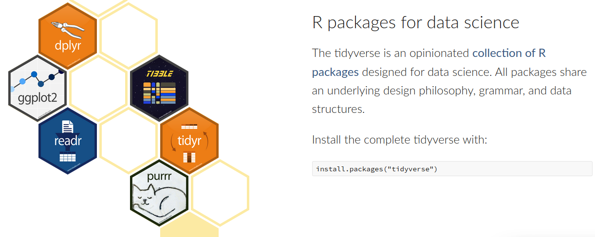

### What is Tidyverse



<https://www.tidyverse.org>

***

### tidyverse in the R ecosystem


***

### Where does Tidyverse come from?


#### Packages are developed and maintained by [RStudio Inc.](https://rstudio.com/) 
* Also make RStudio, Rstudio Server, Shiny, and a variety of other tools.
* Open source with commercial products available. 

#### Many publications including:
* Wickham, Hadley. "Tidy data." Journal of Statistical Software 59.10 (2014): 1-23.
* Wickham, Hadley. "An introduction to ggplot: an implementation of the grammar of graphics in R." Statistics (2006).
* Wickham, Hadley. "ggplot2." Wiley Interdisciplinary Reviews: Computational Statistics 3.2 (2011): 180-185. 
* Wickham, Hadley. "Reshaping data with the reshape package." Journal of statistical software 21.12 (2007): 1-20.

***

### Why was tidyverse invented?
# TODO

<http://r4stats.com/articles/why-r-is-hard-to-learn/>

<https://priceonomics.com/hadley-wickham-the-man-who-revolutionized-r/>

<https://tidyverse.tidyverse.org/articles/manifesto.html>

***

### Tidyverse controversy

<https://www.r-bloggers.com/why-i-dont-use-the-tidyverse/>

<https://github.com/matloff/TidyverseSkeptic>

<https://www.r-bloggers.com/the-tidyverse-curse/>

<http://varianceexplained.org/r/teach-tidyverse/>

<https://ds4ps.org/2019/04/20/datatable-vs-dplyr.html>

*** 

### Alternatives:

* Base R
* {width=75px}[data.table](https://github.com/Rdatatable/data.table/wiki) is a fast alternative with its own special syntax.
  * a tidyverse package, [dtplyr](https://github.com/tidyverse/dtplyr) is in development to prodvide access to it while maintaining tidyverse syntax.
* {width=200px}[Python pandas](https://pandas.pydata.org/) 


***

### Getting setup

In the R console run the following commands to ensure that you have packages installed:


```r
if (!any(rownames(installed.packages()) == "knitr")){
  install.packages("knitr")
}
library(knitr)

if (!any(rownames(installed.packages()) == "tidyverse")){
  install.packages("tidyverse")
}
library(tidyverse)

if (!any(rownames(installed.packages()) == "reshape2")){
  install.packages("reshape2")
}
library(reshape2)

if (!any(rownames(installed.packages()) == "gridExtra")){
  install.packages("gridExtra")
}
library(gridExtra)
```

***

### Download the template Markdown workshop document and open it

In the R console run the following command

```r
download.file("https://raw.githubusercontent.com/ucdavis-bioinformatics-training/2019-Winter-Bioinformatics_Command_Line_and_R_Prerequisites_Workshop/master/intro2R/Intro_to_tidyverse_and_ggplot2.Rmd", "Intro_to_tidyverse_and_ggplot2.Rmd")
```


### Download the data file for the workshop document and preview/open it

This is the stats file generated after running samtools stats on a bam file generated from running BWA MEM.

In the R console run the following command.

```r
download.file("https://raw.githubusercontent.com/ucdavis-bioinformatics-training/2019-Winter-Bioinformatics_Command_Line_and_R_Prerequisites_Workshop/master/intro2R/Data_in_R_files/bwa_mem_Stats.log", "bwa_mem_Stats.log")
```


