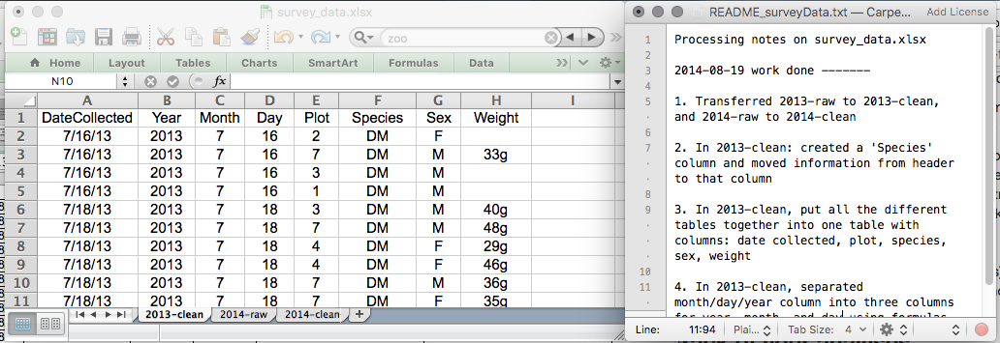
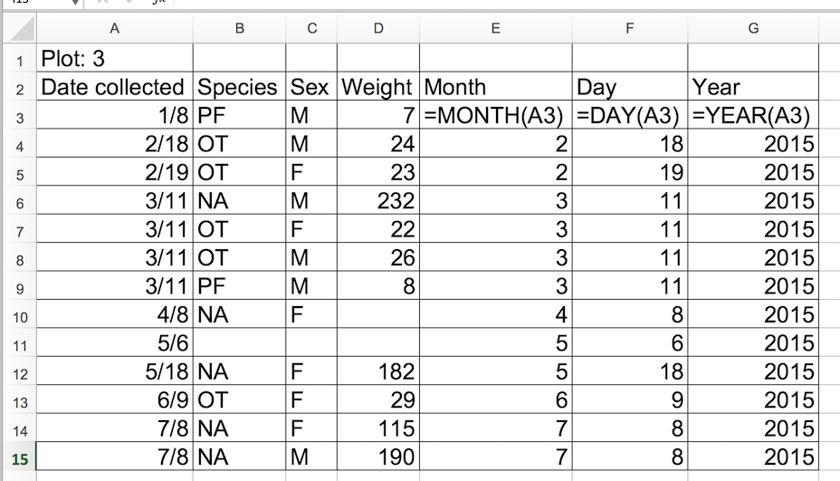
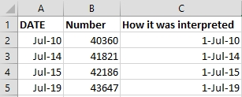
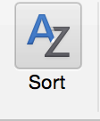
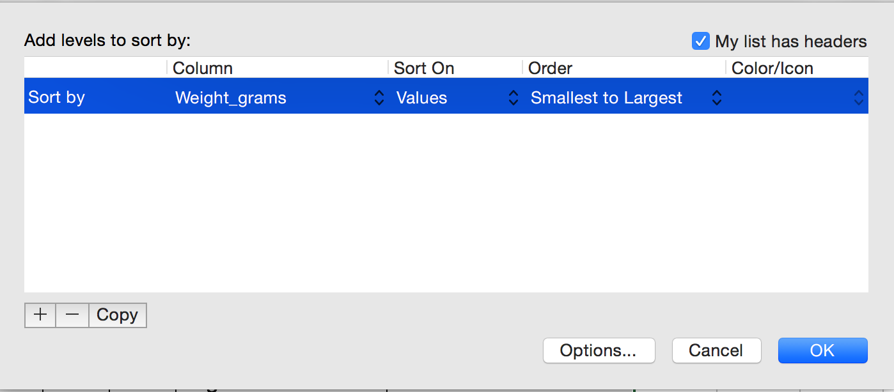
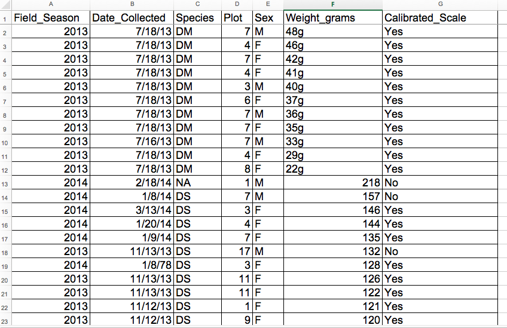
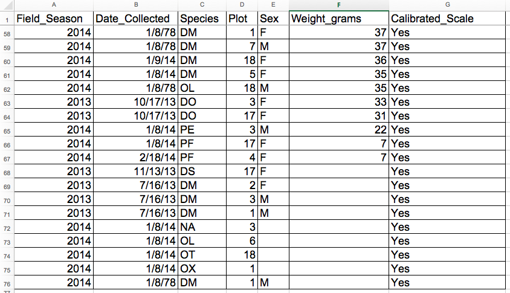
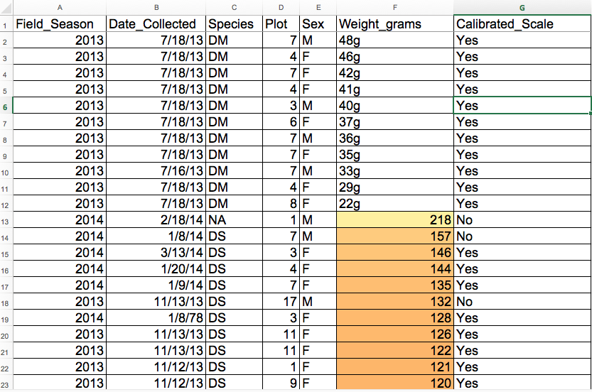

# Working with/from spreadsheets

Goals:
* Implement best practices in data table formatting
* Identify and address common formatting mistakes
* Understand approaches for handling dates in spreadsheets
* Utilize basic quality control features and data manipulation practices
* Effectively export data from spreadsheet programs

## Lesson taken from data carpentry (much unchanged with sone modifications)

https://datacarpentry.org/spreadsheet-ecology-lesson/

Authors:**Christie Bahlai**, **Aleksandra Pawlik** 

Good data organization is the foundation of your research
project. Most researchers have data or do data entry in
spreadsheets. Spreadsheet programs are very useful graphical
interfaces for designing data tables and handling very basic data
quality control functions.

Spreadsheets are good for data entry. Therefore we have a lot of data
in spreadsheets.

### **Download** this data file to your computer: [https://ndownloader.figshare.com/files/2252083](https://ndownloader.figshare.com/files/2252083)

**About the data**

The data for this lesson is a part of the Data Carpentry Ecology workshop.
It is a teaching version of the Portal Database. The data in this lesson
is a subset of the teaching version that has been intentionally 'messed up'
for this lesson.

The data for this lesson and the workshop are in the
[Portal Project Teaching Database](https://figshare.com/articles/Portal_Project_Teaching_Database/1314459)
available on FigShare, with a CC-BY license
available for reuse.

Ernest, M., Brown, J., Valone, T., and White, E.P. (2017). Portal Project Teaching Database. Version 6. Figshare. [DOI: 10.6084/m9.figshare.1314459.v6](https://figshare.com/articles/Portal_Project_Teaching_Database/1314459)

### Problems with Spreadsheets

Spreadsheets are good for data entry, but in reality we tend to
use spreadsheet programs for much more than data entry. We use them
to create data tables for publications, to generate summary
statistics, and make figures.

Generating tables for publications in a spreadsheet is not
optimal - often, when formatting a data table for publication, we’re
reporting key summary statistics in a way that is not really meant to
be read as data, and often involves special formatting
(merging cells, creating borders, making it pretty). We advise you to
do this sort of operation within your document editing software.

The latter two applications, generating statistics and figures, should
be used with caution: because of the graphical, drag and drop nature of
spreadsheet programs, it can be very difficult, if not impossible, to
replicate your steps (much less retrace anyone else's), particularly if your
stats or figures require you to do more complex calculations. Furthermore,
in doing calculations in a spreadsheet, it’s easy to accidentally apply a
slightly different formula to multiple adjacent cells. When using a
command-line based statistics program like R or SAS, it’s practically
impossible to apply a calculation to one observation in your
dataset but not another unless you’re doing it on purpose.

## Formatting data table in Spreadsheets

The most common mistake made is treating spreadsheet programs like lab notebooks, that is,
relying on context, notes in the margin,
spatial layout of data and fields to convey information. As humans, we
can (usually) interpret these things, but computers don't view information the same way, and
unless we explain to the computer what every single thing means (and
that can be hard!), it will not be able to see how our data fits
together.

Using the power of computers, we can manage and analyze data in much more
effective and faster ways, but to use that power, we have to set up
our data for the computer to be able to understand it (and computers are very
literal).

This is why it’s extremely important to set up well-formatted
tables from the outset, before you even start entering data from
your very first preliminary experiment. Data organization is the
foundation of your research project. It can make it easier or harder
to work with your data throughout your analysis, so it's worth
thinking about when you're doing your data entry or setting up your
experiment. You can set things up in different ways in spreadsheets,
but some of these choices can limit your ability to work with the data in other programs or
have the you-of-6-months-from-now or your collaborator work with the
data.

> Note: the best layouts/formats (as well as software and
> interfaces) for data entry and data analysis might be
> different. It is important to take this into account, and ideally
> automate the conversion from one to another.

### Keeping track of your analyses

When you're working with spreadsheets, during data clean up or analyses, it's
very easy to end up with a spreadsheet that looks very different from the one
you started with. In order to be able to reproduce your analyses or figure out
what you did when Reviewer #3 asks for a different analysis, you should

- create a new file with your cleaned or analyzed data. Don't modify
the original dataset, or you will never know where you started!
- keep track of the steps you took in your clean up or analysis. You should track
these steps as you would any step in an experiment. We recommend that you
do this in a plain text file stored in the same folder as the data file.

This might be an example of a spreadsheet setup:

Put these principles in to practice today during your Exercises.

### Structuring data in spreadsheets

The cardinal rule of using spreadsheet programs for data is to keep it "tidy":

1. Put all your variables in columns - the thing you're measuring,
   like 'weight' or 'temperature'.
2. Put each observation in its own row.
3. Don't combine multiple pieces of information in one
   cell. Sometimes it just seems like one thing, but think if that's
   the only way you'll want to be able to use or sort that data.
4. Leave the raw data raw - don't change it!
5. Export the cleaned data to a text-based format like CSV (comma-separated values) format. This
   ensures that anyone can use the data, and is required by
   most data repositories.

For instance, we have data from a survey of small mammals in a desert
ecosystem. Different people have gone to the field and entered data into a spreadsheet. They keep track of things like species, plot,
weight, sex and date collected.

If they were to keep track of the data like this:

the problem is that species and sex are in the same field. So, if they wanted to
look at all of one species or look at different weight distributions by sex,
it would be hard to do this using this data setup. If instead we put sex and species
in different columns, you can see that it would be much easier.

### Columns for variables and rows for observations

The rule of thumb, when setting up a datasheet, is columns =
variables, rows = observations, cells = data (values).

So, instead we should have:

> ## Exercise
>
> We're going to take a messy version of the survey data and describe how we would clean it up.
>
> 1. Download the data by clicking [here](https://ndownloader.figshare.com/files/2252083) to get it from FigShare.
> 2. Open up the data in a spreadsheet program.
> 3. You can see that there are two tabs. Two field assistants conducted the surveys, one
in 2013 and one in 2014, and they both kept track of the data in their own way. Now
you're the person in charge of this project and you want to be able to
start analyzing the data.
> 4. With the person next to you, identify what is wrong with this spreadsheet. Also discuss the steps you would need to take to clean up the 2013 and 2014 tabs, and to put them all together in one spreadsheet.

**Important** Do not forget our first piece of advice: to create a new file (or tab) for the cleaned data, never modify your original (raw) data.

## Common Spreadsheet Errors

There are a few potential errors to be on the lookout for in your own data as well as data from collaborators or the Internet. If you are aware of the errors and the possible negative effect on downstream data analysis and result interpretation, it might motivate yourself and your project members to try and avoid them. Making small changes to the way you format your data in spreadsheets can have a great impact on efficiency and reliability when it comes to data cleaning and analysis.

- [Using multiple tables](#tables)
- [Using multiple tabs](#tabs)
- [Not filling in zeros](#zeros)
- [Using problematic null values](#null)
- [Using formatting to convey information](#formatting)
- [Using formatting to make the data sheet look pretty](#formatting_pretty)
- [Placing comments or units in cells](#units)
- [Entering more than one piece of information in a cell](#info)
- [Using problematic field names](#field_name)
- [Using special characters in data](#special)
- [Inclusion of metadata in data table](#metadata)
- [Date formatting](../03-dates-as-data/)

##  Using multiple tables

A common strategy is creating multiple data tables within
one spreadsheet. This confuses the computer, so don't do this!
When you create multiple tables within one
spreadsheet, you’re drawing false associations between things for the computer,
which sees each row as an observation. You’re also potentially using the same
field name in multiple places, which will make it harder to clean your data up
into a usable form. The example below depicts the problem:

In the example above, the computer will see (for example) row 4 and assume that all columns A-AF
refer to the same sample. This row actually represents four distinct samples
(sample 1 for each of four different collection dates - May 29th, June 12th, June 19th, and June 26th),
as well as some calculated summary statistics (an average (avr) and standard error of measurement (SEM)) for two of those samples. Other rows are similarly problematic.

##  Using multiple tabs

But what about workbook tabs? That seems like an easy way to organize data, right? Well, yes and no. When you create extra tabs, you fail to allow the computer to see connections in the data that are there (you have to introduce spreadsheet application-specific functions or scripting to ensure this connection). Say, for instance, you make a separate tab for each day you take a measurement.

This isn't good practice for two reasons:
1) you are more likely to accidentally add inconsistencies to your data if each time you take a measurement, you start recording data in a new tab, and
2) even if you manage to prevent all inconsistencies from creeping in, you will add an extra step for yourself before you analyze the
data because you will have to combine these data into a single datatable. You will have to explicitly tell the computer how to combine
tabs - and if the tabs are inconsistently formatted, you might even have to do it manually.

The next time you’re entering data, and you go to create another tab or table, ask yourself if you could avoid adding this tab by adding another column to your original spreadsheet. We used multiple tabs in our example of a messy data file, but now you've seen how you can reorganize your data to consolidate across tabs.

Your data sheet might get very long over the course of the experiment. This makes it harder to enter data if you can’t see your headers
at the top of the spreadsheet. But don't repeat your header row. These can easily get mixed into the data,
leading to problems down the road.

Instead you can freeze the column headers so that they remain visible even when you have a spreadsheet with many rows.

[Documentation on how to freeze column headers in MS Excel](https://support.office.com/en-ca/article/Freeze-column-headings-for-easy-scrolling-57ccce0c-cf85-4725-9579-c5d13106ca6a)

##  Not filling in zeros

It might be that when you're measuring something, it's
usually a zero, say the number of times a rabbit
is observed in the survey. Why bother
writing in the number zero in that column, when it's mostly zeros?

However, there's a difference between a zero and a blank cell in a spreadsheet. To the computer, a zero is actually data. You measured
or counted it. A blank cell means that it wasn't measured and the computer will interpret it as an unknown value (otherwise known as a
null value).

The spreadsheets or statistical programs will likely mis-interpret blank cells that you intend to be zeros. By not entering the value of
your observation, you are telling your computer to represent that data as unknown or missing (null). This can cause problems with
subsequent calculations or analyses. For example, the average of a set of numbers which includes a single null value is always null
(because the computer can't guess the value of the missing observations). Because of this, it's very important to record zeros as zeros and truly missing data as nulls.

##  Using problematic null values
**Example**: using -999 or other numerical values (or zero) to represent missing data.

**Solutions**:

There are a few reasons why null values get represented differently within a dataset.
Sometimes different null values are used to convey different reasons why the data isn't there. This is important information to capture, but is in effect using one column to capture two pieces of information. Like for [using formatting to convey information](#formatting) it would be good here to create a new column like 'data_missing' and use that column to capture the different reasons.

Whatever the reason, it's a problem if unknown or missing data is recorded as -999, 999, or 0.
Many statistical programs will not recognize
that these are intended to represent missing (null) values. How these values are interpreted will depend on the software you use to
analyze your data. It is essential to use a clearly defined and consistent null indicator.
Blanks (most applications) and NA (for R) are good choices. White et al, 2013, explain good choices for indicating null values for different software applications in their article:
[Nine simple ways to make it easier to (re)use your data.](https://peerj.com/preprints/7/) Ideas in Ecology and Evolution.

##  Using formatting to convey information

**Example**: highlighting cells, rows or columns that should be excluded from an analysis, leaving blank rows to indicate separations in data.

**Solution**: create a new field to encode which data should be excluded.

##  Using formatting to make the data sheet look pretty

**Example**: merging cells.

**Solution**: If you’re not careful, formatting a worksheet to be more aesthetically pleasing can compromise your computer’s ability to
see associations in the data. Merged cells will make your data unreadable by statistics software. Consider restructuring your data in
such a way that you will not need to merge cells to organize your data.

##  Placing comments or units in cells

**Example**: Your data was collected, in part, by a summer student who you later found out was mis-identifying some of your species, some
of the time. You want a way to note these data are suspect.

**Solution**: Most analysis software can't see Excel or LibreOffice comments, and would be confused by comments placed within your data
cells. As described above for formatting, create another field if you need to add notes to cells. Similarly, don’t include units in
cells: ideally, all the measurements you place in one column should be in the same unit, but if for some reason they aren’t, create
another field and specify the units the cell is in.

##  Entering more than one piece of information in a cell

**Example**: You find one male, and one female of the same species. You enter this as 1M, 1F.

**Solution**: Don't include more than one piece of information in a cell. This will limit the ways in which you can analyze your data.
If you need both these measurements, design your data sheet to include this information. For example, include one column for number of
individuals and a separate column for sex.

##  Using problematic field names
Choose descriptive field names, but be careful not to include spaces, numbers, or special characters of any kind. Spaces can be
misinterpreted by parsers that use whitespace as delimiters and some programs don’t like field names that are text strings that start
with numbers.

Underscores (`_`) are a good alternative to spaces. Consider writing names in camel case (like this: ExampleFileName) to improve
readability. Remember that abbreviations that make sense at the moment may not be so obvious in 6 months, but don't overdo it with names
that are excessively long. Including the units in the field names avoids confusion and enables others to readily interpret your fields.

**Examples**

<table align = "left" style = "width =100%; border: 1px solid black;">
<tr>
	<td> <b>Good Name</b></td>  
	<td> <b>Good Alternative </b> </td> 
	<td> <b>Avoid </b></td> 
</tr>
<tr>
	<td> Max_temp_C</td>
	<td> MaxTemp </td>
	<td> Maximum Temp (°C) </td>
</tr>
<tr>
	<td> Precipitation_mm</td>
	<td> Precipitation</td>
	<td> precmm </td>
</tr>
<tr>
	<td> Mean_year_growth</td>
	<td> MeanYearGrowth </td>
	<td> Mean growth/year</td>
</tr>
<tr>
	<td> sex </td>
	<td> sex </td>
	<td> M/F </td>
</tr>
<tr>
	<td> weight </td>
	<td> weight </td>
	<td> w.</td>
</tr>
<tr>
	<td> cell_type </td>
	<td> CellType </td>
	<td> Cell Type </td>
</tr>
<tr>
	<td> Observation_01 </td>
	<td> first_observation</td>
	<td> 1st Obs</td>
</tr>
</table>

##  Using special characters in data

**Example**: You treat your spreadsheet program as a word processor when writing notes, for example copying data directly from Word or
other applications.

**Solution**: This is a common strategy. For example, when writing longer text in a cell, people often include line breaks, em-dashes,
etc in their spreadsheet.  Also, when copying data in from applications such as Word, formatting and fancy non-standard characters (such
as left- and right-aligned quotation marks) are included.  When exporting this data into a coding/statistical environment or into a
relational database, dangerous things may occur, such as lines being cut in half and encoding errors being thrown.

General best practice is to avoid adding characters such as newlines, tabs, and vertical tabs.  In other words, treat a text cell as if
it were a simple web form that can only contain text and spaces.

##  Inclusion of metadata in data table

**Example**: You add a legend at the top or bottom of your data table explaining column meaning, units, exceptions, etc.

**Solution**: Recording data about your data (“metadata”) is essential. You may be on intimate terms with your dataset while you are
collecting and analysing it, but the chances that you will still remember that the variable "sglmemgp" means single member of group, for
example, or the exact algorithm you used to transform a variable or create a derived one, after a few months, a year, or more are slim.

As well, there are many reasons other people may want to examine or use your data - to understand your findings, to verify your findings,
to review your submitted publication, to replicate your results, to design a similar study, or even to archive your data for access and
re-use by others. While digital data by definition are machine-readable, understanding their meaning is a job for human beings. The
importance of documenting your data during the collection and analysis phase of your research cannot be overestimated, especially if your
research is going to be part of the scholarly record.

However, metadata should not be contained in the data file itself. Unlike a table in a paper or a supplemental file, metadata (in the
form of legends) should not be included in a data file since this information is not data, and including it can disrupt how computer
programs interpret your data file. Rather, metadata should be stored as a separate file in the same directory as your data file,
preferably in plain text format with a name that clearly associates it with your data file. Because metadata files are free text format,
they also allow you to encode comments, units, information about how null values are encoded, etc. that are important to document but can
disrupt the formatting of your data file.

Additionally, file or database level metadata describes how files that make up the dataset relate to each other; what format are they are
in; and whether they supercede or are superceded by previous files. A folder-level readme.txt file is the classic way of accounting for
all the files and folders in a project.

(Text on metadata adapted from the online course Research Data [MANTRA](http://datalib.edina.ac.uk/mantra) by EDINA and Data Library, University of Edinburgh. MANTRA is licensed under a [Creative Commons Attribution 4.0 International License](https://creativecommons.org/licenses/by/4.0/).)

## Dates as data

Dates in spreadsheets are stored in a single column. While this seems the
most natural way to record dates, it actually is not best
practice. A spreadsheet application will display the dates in a
seemingly correct way (to a human observer) but how it actually handles
and stores the dates may be problematic.

In particular, please remember that functions that are valid for a given
spreadsheet program (be it LibreOffice, Microsoft Excel, OpenOffice,
Gnumeric, etc.) are usually guaranteed to be compatible only within the same
family of products. If you will later need to export the data and need to
conserve the timestamps, you are better off handling them using one of the solutions discussed below.

Additionally, Excel can [turn things that aren't dates into dates](https://nsaunders.wordpress.com/2012/10/22/gene-name-errors-and-excel-lessons-not-learned/),
for example names or identifiers like MAR1, DEC1, OCT4. So if you're avoiding the date format overall, it's easier to identify these issues.

### Exercise

*Challenge:* pulling month, day and year out of dates

In the `dates` tab of your spreadsheet you have the data from 2014 plot 3.
There's a `Date collected` column.
Let’s extract month, day and year from the dates to new columns. For this we can use the built in Excel functions

* `YEAR()`
* `MONTH()`
* `DAY()`

*Important:* Make sure the new column is formatted as a number and not as a date.

You can see that even though you wanted the year to be 2014, your spreadsheet program automatically interpreted it as 2015, the year you entered the data.

### Solution

### Exercise

**Challenge:** pulling hour, minute and second out of the current time

Current time and date are best retrieved using the functions `NOW()`, which returns the current date and time, and `TODAY()`, which returns the current date. The results will be formatted according to your computer's settings.

1) Extract the year, month and day from the current date and time string returned by the `NOW()` function.

2) Calculate the current time using `NOW()-TODAY()`.

3) Extract the hour, minute and second from the current time using

functions `HOUR()`, `MINUTE()` and `SECOND()`.

4) Press `F9` to force the spreadsheet to recalculate the `NOW()` function, and check that it has been updated.

### Solution

1) To get the year, type `=YEAR(NOW())` into any cell in your spreadsheet. To get the month, type `=MONTH(NOW())`. To get the day, type `=DAY(NOW())`.

2) Typing `=NOW()-TODAY()` will result in a decimal value that is not easily human parsable to a clock-based time. You will need to use the strategies in the third part of this challenge to convert this decimal value to readable time.

3) To extract the hour, type `=HOUR(NOW()-TODAY())` and similarly for minute and second.

### Preferred date format

It is much safer to store dates with [YEAR, MONTH, DAY](#day) in separate columns or as [YEAR and DAY-OF-YEAR](#doy) in separate columns.

**Note**: Excel is unable to parse dates from before 1899-12-31, and will thus leave these untouched.  If you’re mixing historic data
from before and after this date, Excel will translate only the post-1900 dates into its internal format, thus resulting in mixed data.
If you’re working with historic data, be extremely careful with your dates!

Excel also entertains a second date system, the 1904 date system, as the default in Excel for Macintosh. This system will assign a
different serial number than the [1900 date system](https://support.microsoft.com/en-us/help/214330/differences-between-the-1900-and-the-1904-date-system-in-excel). Because of this,
[dates must be checked for accuracy when exporting data from Excel](http://uc3.cdlib.org/2014/04/09/abandon-all-hope-ye-who-enter-dates-in-excel/) (look for dates that are ~4 years off).

## Date formats in spreadsheets

Spreadsheet programs have numerous “useful features” which allow them to handle dates in a variety of ways.

But these "features" often allow ambiguity to creep into your data. Ideally, data should be as unambiguous as possible.

### Dates stored as integers

The first thing you need to know is that Excel stores dates as numbers - see the last column in the above figure. Essentially, it counts the days from a default of December 31, 1899, and thus stores July 2, 2014 as  the serial number 41822.

(But wait. That’s the default on my version of Excel. We’ll get into how this can introduce problems down the line later in this lesson. )

This serial number thing can actually be useful in some circumstances. By using
the above functions we can easily add days, months or years to a given date.
Say you had a sampling plan where you needed to sample every thirty seven days.
In another cell, you could type:

    =B2+37

And it would return

    8-Aug

because it understands the date as a number `41822`, and `41822 + 37 = 41859`
which Excel interprets as August 8, 2014. It retains the format (for the most
part) of the cell that is being operated upon, (unless you did some sort of
formatting to the cell before, and then all bets are off). Month and year
rollovers are internally tracked and applied.

**Note**
Adding years and months and days is slightly trickier because we need to make
sure that we are adding the amount to the correct entity.

- First we extract the single entities (day, month or year)
- We can then add values to to that
- Finally the complete date string is reconstructed using the `DATE()` function.

As for dates, times are handled in a similar way; seconds can be directly
added but to add hour and minutes we need to make sure that we are adding
the quantities to the correct entities.

Which brings us to the many different ways Excel provides in how it displays dates. If you refer to the figure above, you’ll see that
there are many ways that ambiguity creeps into your data depending on the format you chose when you enter your data, and if you’re not
fully aware of which format you’re using, you can end up actually entering your data in a way that Excel will badly misinterpret.

### Exercise

What happens to the dates in the "dates" tab of our workbook if we save this sheet in Excel (in `csv` format) and then open the file in a plain text editor (like TextEdit or Notepad)? What happens to the dates if we then open the `csv` file in Excel?

### Solution

- Click to the "dates" tab of the workbook and double-click on any of the values in the `Date collected` column. Notice that the dates display with the year 2015.
- Select `File -> Save As` in Excel and in the drop down menu for file format select `CSV UTF-8 (Comma delimited) (.csv)`. Click `Save`.
- You will see a pop-up that says "This workbook cannot be saved in the selected file format because it contains multiple sheets." Choose `Save Active Sheet`.
- Navigate to the file in your finder application. Right click and select `Open With`. Choose a plain text editor application and view the file. Notice that the dates display as month/day without any year information.
- Now right click on the file again and open with Excel. Notice that the dates display with the current year, not 2015.

As you can see, exporting data from Excel and then importing it back into Excel fundamentally changed the data!

**Note**
You will notice that when exporting into a text-based format (such as CSV), Excel will export its internal date integer instead of a useful value (that is, the dates will be represented as integer numbers). This can potentially lead to problems if you use other software to manipulate the file.

### Advantages of Alternative Date Formatting

###  Storing dates as YEAR, MONTH, DAY

Storing dates in YEAR, MONTH, DAY format helps remove this ambiguity. Let's look at this issue a bit closer.

For instance this is a spreadsheet representing insect counts that were taken every few days over the summer, and things went something like this:

If Excel was to be believed, this person had been collecting bugs **in the future**. Now, we have no doubt this person is highly capable,
but I believe time travel was beyond even their grasp.

Entering dates in one cell is helpful but due to the fact that the spreadsheet programs may interpret and save the data in different ways
(doing that somewhat behind the scenes), there is a better practice.

In dealing with dates in spreadsheets, separate date data into separate fields (day, month, year), which will eliminate any chance of
ambiguity.

###  Storing dates as YEAR, DAY-OF-YEAR

There is also another option. You can also store dates as year and day of year (DOY). Why? Because depending on your
question, this might be what's useful to you, and there is practically no possibility for ambiguity creeping in.

Statistical models often incorporate year as a factor, or a categorical variable, rather than a numeric variable, to account for
year-to-year variation, and DOY can be used to measure the passage of time within a year.

So, can you convert all your dates into DOY format? Well, in Excel, here’s a useful guide:

###  Storing dates as a single string

Another alternative could be to convert the date string
into a single string using the `YYYYMMDDhhmmss` format.
For example the date `March 24, 2015 17:25:35` would
become `20150324172535`, where:

YYYY:   the full year, i.e. 2015
MM:     the month, i.e. 03
DD:     the day of month, i.e. 24
hh:     hour of day, i.e. 17
mm:     minutes, i.e. 25
ss:     seconds, i.e. 35

Such strings will be correctly sorted in ascending or descending order, and by
knowing the format they can then be correctly processed by the receiving

# Quality Control

Tip: *Before doing any quality control operations, save your original file with the formulas and a name indicating it is the original
data. Create a separate file with appropriate naming and versioning, and ensure your data is stored as values and not as formulas.
Because formulas refer to other cells, and you may be moving cells around, you may compromise the integrity of your data if you do not
take this step!*

## Sorting
Bad values often sort to the bottom or top of the column. For example, if your data should be numeric, then alphabetical and null data
will group at the ends of the sorted data. Sort your data by each field, one at a time. Scan through each column, but pay the most
attention to the top and the bottom of a column.
If your dataset is well-structured and does not contain formulas, sorting should never affect the integrity of your dataset.

**Remember** to expand your sort in order to prevent data corruption. Expanding your sort ensures that the all the data in one row move together instead of only sorting a single column in isolation. Sorting by only a single column will scramble your data - a single row will no longer represent an individual observation.

### Exercise

We've combined all of the tables from the messy data into a single table in a single tab. Download this semi-cleaned data file to your computer: [survey_sorting_exercise](https://github.com/datacarpentry/spreadsheet-ecology-lesson/blob/gh-pages/data/survey_sorting_exercise.xlsx?raw=true)

Once downloaded, sort the `Weight_grams` column in your spreadsheet program from `Largest to Smallest`.

_What do you notice?_

### Solution

Click the Sort button on the data tab in Excel. A pop-up will appear. Make sure you select `Expand the selection`.

The following window will display, choose the column you want to sort as well as the sort order.

**Note** how the odd values sort to the top and bottom of the tabular data.

The cells containing no data values sort to the bottom of the tabular data, while the cells where the letter "g" was included can be found towards the top. This is a powerful way to check your data for outliers and odd values.

## Conditional formatting ##
Conditional formatting basically can do something like color code your values by some
criteria or lowest to highest. This makes it easy to scan your data for outliers.

Conditional formatting should be used with caution, but it can be a great way to flag inconsistent values when entering data.

## Exercise
1. Make sure the Weight_grams column is highlighted.

2. In the main Excel menu bar, click `Home` > `Conditional Formatting...` choose a formatting rule.

3. Apply any `2-Color Scale` formatting rule.

4. Now we can scan through and different colors will stand out. Do you notice any strange values?

### Solution

Cells that contain non-numerical values are not colored. This includes both the cells where the letter "g" was included and the empty cells.

It is nice to be able to do these scans in spreadsheets, but we also can do these
checks in a programming language like R, or in OpenRefine or SQL.

## Exporting data

Storing the data you're going to work with for your analyses in Excel default file format (`*.xls` or `*.xlsx` - depending on the Excel version) isn't a good idea. Why?

- Because it is a proprietary format, and it is possible that in the future, technology won’t exist (or will become sufficiently rare) to make it inconvenient, if not impossible, to open the file.

- Other spreadsheet software may not be able to open files saved in a proprietary Excel format.

- Different versions of Excel may handle data differently, leading to inconsistencies.

- Finally, more journals and grant agencies are requiring you to deposit your data in a data repository, and most of them don't accept Excel format. It needs to be in one of the formats discussed below.

- The above points also apply to other formats such as open data formats used by LibreOffice / Open Office. These formats are not static and do not get parsed the same way by different software packages.

As an example of inconsistencies in data storage, do you remember how we talked about how Excel stores dates earlier? It turns out that
there are multiple defaults for different versions of the software, and you can switch between them all. So, say you’re
compiling Excel-stored data from multiple sources. There are dates in each file - Excel interprets them as their own internally consistent
serial numbers. When you combine the data, Excel will take the serial number from the place you’re importing it from, and interpret it
using the rule set for the version of Excel you’re using. Essentially, you could be adding errors to your data, and it wouldn’t
necessarily be flagged by any data cleaning methods if your ranges overlap.

Storing data in a universal, open, and static format will help deal with this problem. Try tab-delimited (tab separated values
or TSV) or comma-delimited (comma separated values or CSV). CSV files are plain text files where the columns are separated by commas,
hence 'comma separated values' or CSV. The advantage of a CSV file over an Excel/SPSS/etc. file is that we can open and read a CSV file
using just about any software, including plain text editors like TextEdit or NotePad.
Data in a CSV file can also be easily imported into other formats and
environments, such as SQLite and R. We're not tied to a certain version of a certain expensive program when we work with CSV files, so
it's a
good format to work with for maximum portability and endurance. Most spreadsheet programs can save to delimited text formats like CSV
easily, although they may give you a warning during the file export.

To save a file you have opened in Excel in CSV format:

1. From the top menu select 'File' and 'Save as'.
2. In the 'Format' field, from the list, select 'Comma Separated Values' (`*.csv`).
3. Double check the file name and the location where you want to save it and hit 'Save'.

An important note for backwards compatibility: you can open CSV files in Excel!

#### A note on R and `.xlsx`

There are R packages that can read `.xls` or `.xlsx` files (as well as
Google spreadsheets). It is even possible to access different
worksheets in the `.xlsx` documents.

**But**

- some of these only work on Windows
- this equates to replacing a (simple but manual) export to `csv` with
  additional complexity/dependencies in the data analysis R code
- data formatting best practice still apply
- Is there really a good reason why `csv` (or similar) is not adequate?

#### Caveats on commas

In some datasets, the data values themselves may include commas (,). In that case, the software which you use (including Excel)
will most likely incorrectly display the data in columns. This is because the commas which are a part of the data values will be
interpreted as delimiters.

If you are working with data that contains commas, you likely will need to use another delimiter when working in a spreadsheet. In this
case, consider using tabs as your delimiter and working with TSV files. TSV files can be exported from spreadsheet
programs in the same way as CSV files.
